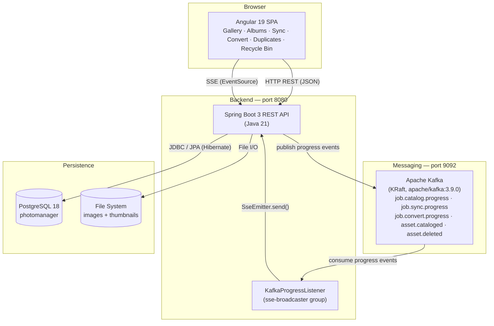
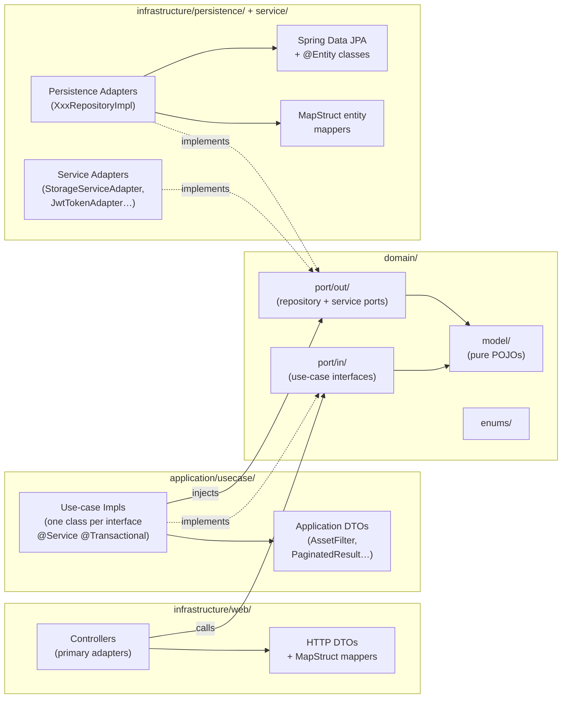
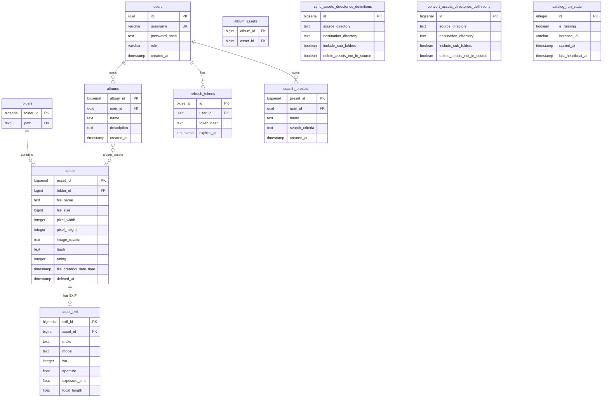
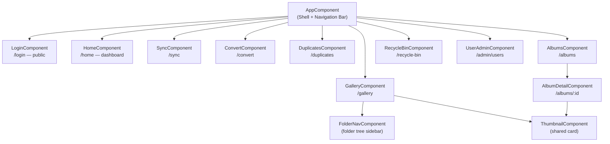
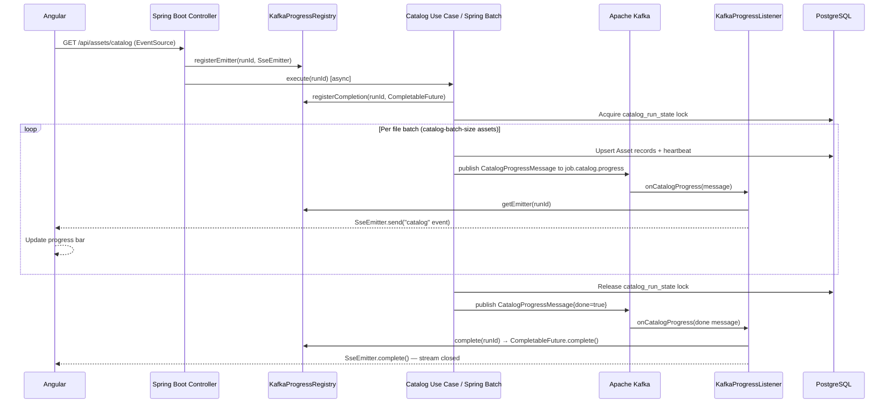

# JP Photo Manager — Web Edition

A web rewrite of the JP Photo Manager desktop application. It replaces the original WPF/.NET application with a modern client–server architecture: a **Java 21 + Spring Boot 3** REST API backend and an **Angular 19** single-page application frontend.

---

## Features

### Gallery

- **Thumbnail grid** — paginated 200×150 thumbnail cards for all images in the selected folder.
- **Full-screen viewer** — double-click any thumbnail to open the original at full resolution with zoom controls; press the grid icon to return.
- **Folder tree navigation** — collapsible sidebar showing the catalogued folder hierarchy; click any folder to load its assets.
- **Search and filter** — filter assets by file name, date range, and minimum star rating.
- **Sort** — sort by file name, creation date, modification date, file size, or rating.
- **Star rating** — rate each image 0–10 stars directly from the thumbnail grid or viewer.
- **EXIF metadata panel** — view camera make and model, ISO, aperture, exposure time, and focal length extracted from image files.
- **Move / copy** — select one or more images and move or copy them to another catalogued folder.
- **Drag-and-drop upload** — drag files from the desktop and drop them onto the gallery to upload them.
- **Download** — download a selection of images as a ZIP archive (up to the configured `max-download-assets` limit).
- **Add to album** — add selected images to an existing album or create a new one on the spot.
- **Soft delete** — deleting images sends them to the Recycle Bin rather than removing them permanently.

### Albums

- Create, rename, and delete personal albums.
- Add or remove individual assets from an album.
- Paginated asset grid within each album, with the same thumbnail viewer as the main gallery.

### Duplicate Detection

- Scans the catalog for images that share the same SHA-256 hash.
- Groups duplicate sets side-by-side for visual comparison.
- Select duplicates to delete; originals are preserved.

### Directory Sync

- Define one or more **source → destination** directory pairs.
- Optional per-pair settings: include sub-folders, delete files from the destination that are no longer in the source.
- Execute the sync and watch live progress streamed via Server-Sent Events.

### PNG → JPEG Conversion

- Define one or more **source → destination** directory pairs for conversion.
- Optional per-pair settings: include sub-folders, delete source PNG after conversion.
- Execute the conversion and watch live progress streamed via Server-Sent Events.

### Recycle Bin

- All deleted images land in the Recycle Bin with a `deleted_at` timestamp (soft delete).
- **Restore** — move images back to their original folder and re-add them to the catalog.
- **Purge** — permanently delete selected images from disk and the database.

### Dashboard

- At-a-glance statistics: total catalogued folders, total assets, combined file size, and average star rating across the library.

### Image Cataloging

- The backend automatically scans all configured root folders on startup and then re-scans after a configurable cooldown (default: 2 minutes).
- Generates 200×150 JPEG thumbnails, computes SHA-256 hashes, and extracts EXIF metadata for every discovered image.
- A distributed lock (`catalog_run_state` table) prevents overlapping runs across multiple backend instances.
- A heartbeat mechanism and stale-run detection recover from crashed catalog processes.

### Real-Time Progress

- Catalog, sync, and convert operations stream live progress events to the browser using **Server-Sent Events** — no polling required.
- Each event carries the number of processed items, the total count, and the current folder being processed.

### Authentication & User Management

- **JWT authentication** via HttpOnly cookie (`SameSite=Strict`) — tokens are never exposed to JavaScript.
- Proactive token refresh (5 minutes before expiry) keeps sessions alive without requiring re-login.
- **User Administration** page (`/admin/users`) — create users, change passwords, and delete users; no self-registration.
- Default administrator account (`admin`/`admin`) is seeded automatically on first startup.

---

## Architecture

### System Architecture



### Backend Hexagonal Architecture

The backend follows **Hexagonal (Ports and Adapters) Architecture** with strict, unidirectional layer dependencies enforced by package naming.



**Dependency flow:** `infrastructure/web → application/usecase → domain ← infrastructure/persistence | infrastructure/service`

The domain layer (`domain/model/`, `domain/port/in/`, `domain/port/out/`) has zero `jakarta.*`, `org.springframework.*`, or infrastructure imports.

Controllers in `infrastructure/web/controller/` delegate directly to use-case interfaces and never touch repositories or service adapters directly.

**Naming conventions:**
- Repository port interfaces: `XxxRepository` (in `domain/port/out/`) → `XxxRepositoryImpl` (in `infrastructure/persistence/adapter/`)
- Service port interfaces: `XxxPort` (in `domain/port/out/`) → `XxxServiceAdapter` (in `infrastructure/service/`)
- All entity↔domain and DTO↔domain conversions go through MapStruct-generated mappers; the `toEntityRef` pattern is used for FK-only references to avoid accidental updates to the referenced row

### Database Schema



### Frontend Component Hierarchy

All routes are lazy-loaded via Angular's `loadComponent()`. Every route except `/login` is protected by `authGuard`, which redirects unauthenticated users to `/login`.



### Project Structure

```
JPPhotoManagerWeb/
├── backend/            # Java 21 + Spring Boot 3 Maven project
│   ├── Dockerfile      # Multi-stage build (Maven → JRE Alpine)
│   └── .dockerignore
├── frontend/           # Angular 19 npm project
│   ├── Dockerfile      # Multi-stage build (Node → Nginx Alpine)
│   ├── nginx.conf      # Serves SPA + reverse-proxies /api to backend
│   └── .dockerignore
├── grafana/provisioning/  # Grafana datasource + dashboard provisioning
├── prometheus.yml         # Prometheus scrape config
├── docker-compose.yml     # Orchestrates db, kafka, redis, mongo, backend,
│                          # frontend, prometheus, and grafana
├── .env.example           # Template for local Docker Compose configuration
├── k8s/                   # Kubernetes manifests (one StatefulSet/Deployment
│   │                      # + Service per docker-compose service)
│   ├── namespace.yaml
│   ├── configmap.yaml
│   ├── secret.yaml.example  # Template — copy to secret.yaml (git-ignored)
│   ├── catalog-volumes.yaml.example  # Template — copy to catalog-volumes.yaml
│   │                                 # (git-ignored); patched onto backend.yaml
│   ├── postgres.yaml         # `db`        → headless Service + StatefulSet
│   ├── kafka.yaml             # `kafka`     → headless Service + StatefulSet
│   ├── redis.yaml             # `redis`     → Service + Deployment
│   ├── mongo.yaml             # `mongo`     → headless Service + StatefulSet
│   ├── backend.yaml           # `backend`   → Service + Deployment + PVC
│   │                          # (no catalog hostPath — see catalog-volumes.yaml)
│   ├── frontend.yaml          # `frontend`  → Service + Deployment
│   ├── prometheus.yaml        # `prometheus`→ Service + Deployment
│   ├── grafana.yaml           # `grafana`   → Service + Deployment + PVC
│   └── ingress.yaml           # Routes external traffic to `frontend`
└── kustomization.yaml     # Entry point: `kubectl apply -k .`
```

---

## Backend

### Technologies

| Technology | Version |
|---|---|
| Java | 21 |
| Spring Boot | 3.4.4 |
| Spring Web (REST + SSE) | managed by Spring Boot |
| Spring Data JPA | managed by Spring Boot |
| Spring Batch | managed by Spring Boot |
| Spring Kafka | managed by Spring Boot |
| Spring Validation | managed by Spring Boot |
| Spring Actuator | managed by Spring Boot |
| Hibernate (PostgreSQL dialect) | managed by Spring Boot |
| PostgreSQL JDBC | managed by Spring Boot |
| Flyway + Flyway PostgreSQL extension | managed by Spring Boot |
| Apache Kafka (KRaft) | 3.9.0 (via Docker) |
| Lombok | 1.18.46 |
| MapStruct | 1.6.3 |
| Apache Commons Imaging | 1.0-alpha3 |
| GitHub API client | 1.321 |
| JUnit 5 + Mockito + AssertJ | managed by Spring Boot |
| Testcontainers (PostgreSQL) | managed by Spring Boot |
| Spring Kafka Test (`@EmbeddedKafka`) | managed by Spring Boot |

### Internal architecture

The backend follows a clean architecture with strict layering:

```
api/                     → REST controllers and request/response DTOs
application/usecase/     → Use-case implementations (one class per port/in interface)
application/dto/         → Application DTOs: progress messages (CatalogProgressMessage,
                           SyncProgressMessage, ConvertProgressMessage) and result types
domain/
  model/                 → Pure domain POJOs (Asset, Folder, …)
  enums/                 → ImageRotation, SortCriteria, WallpaperStyle, ReasonEnum
  port/in/               → Use-case interfaces
  port/out/              → Repository and service port interfaces
infrastructure/
  web/                   → REST controllers, HTTP DTOs, MapStruct mappers
  persistence/           → Spring Data JPA adapters (XxxRepositoryImpl, @Entity classes)
  service/               → Service adapters: StorageServiceAdapter, ThumbnailStorageService,
                           KafkaProgressRegistry (runId → SseEmitter + CompletableFuture map)
  kafka/                 → KafkaProgressListener — @KafkaListener on all three progress topics;
                           routes messages to SseEmitter via KafkaProgressRegistry
  batch/                 → Spring Batch job config and item writers/listeners (catalog pipeline)
  config/                → AppConfig (CORS, async executor), KafkaTopicConfig (topic declarations)
```

**Dependency flow:** `api` → `application` → `domain` ← `infrastructure`

Controllers are thin: they delegate immediately to use-case interfaces and never touch repositories or service adapters directly.

### Key services

| Service / Use Case | Description |
|---|---|
| `CatalogAssetsUseCase` | Registers a `CompletableFuture<Void>` in `KafkaProgressRegistry`, then launches a Spring Batch job. The Batch item writer publishes `CatalogProgressMessage` events to `job.catalog.progress`; `KafkaProgressListener` forwards each event to the waiting `SseEmitter` and completes the future on `done=true`. |
| `SyncAssetsUseCase` | `@Async void`; publishes `SyncProgressMessage` status events to `job.sync.progress` while syncing, then a final `done=true` message with results when complete. |
| `ConvertAssetsUseCase` | `@Async void`; same pattern — publishes `ConvertProgressMessage` events to `job.convert.progress`. |
| `FindDuplicatedAssetsUseCase` | Groups assets by hash and filters out stale catalog entries. |
| `MoveAssetsUseCase` | Copies or moves files on disk and updates the corresponding DB record. |
| `KafkaProgressRegistry` | Thread-safe `ConcurrentHashMap` keyed by `runId`; holds the `SseEmitter` registered by the controller and the `CompletableFuture<Void>` registered by the catalog use case. Bridges Kafka consumer callbacks back to waiting HTTP connections. |
| `KafkaProgressListener` | `@KafkaListener` on `job.catalog.progress`, `job.sync.progress`, and `job.convert.progress` (consumer group `sse-broadcaster`). Routes each message to the `SseEmitter` for its `runId`; calls `registry.complete(runId)` on `done=true`. |
| `StorageService` | File I/O, thumbnail generation, EXIF rotation reading (Apache Commons Imaging), SHA-256 hashing. |
| `ThumbnailStorageService` | Stores and retrieves thumbnails as `{assetId}.bin` files under the configured thumbnails directory. |

### Persistence

- **Database:** PostgreSQL 18
- **Schema migrations:** Flyway, scripts in `src/main/resources/db/migration/`
- **ORM:** Spring Data JPA with the Hibernate PostgreSQL dialect
- **Connection:** configured via environment variables `POSTGRES_HOST`, `POSTGRES_PORT`, `POSTGRES_DB`, `POSTGRES_USERNAME`, `POSTGRES_PASSWORD` (defaults: `localhost`, `5432`, `photomanager`, `postgres`, `postgres`)

### REST API

| Method | Path | Description |
|---|---|---|
| `GET` | `/api/assets` | Paginated asset list for a folder (`folderPath`, `page`, `sort`) |
| `GET` | `/api/assets/{id}/thumbnail` | 200×150 JPEG thumbnail |
| `GET` | `/api/assets/{id}/image` | Full-size original image |
| `GET` | `/api/assets/catalog` | SSE stream — catalog progress events |
| `GET` | `/api/assets/duplicates` | Grouped duplicate assets |
| `POST` | `/api/assets/move` | Move or copy assets to a destination folder |
| `DELETE` | `/api/assets` | Remove assets from catalog (optionally delete files) |
| `GET` | `/api/folders` | Catalogued folders, optionally filtered by `parentPath` |
| `GET` | `/api/folders/drives` | Available filesystem roots |
| `GET` | `/api/folders/initial` | Configured initial folder |
| `GET` | `/api/folders/recent-paths` | Recently used destination paths |
| `GET` | `/api/sync/configuration` | Load sync directory pairs |
| `PUT` | `/api/sync/configuration` | Save sync directory pairs |
| `GET` | `/api/sync/run` | SSE stream — run sync and stream status |
| `GET` | `/api/convert/configuration` | Load convert directory pairs |
| `PUT` | `/api/convert/configuration` | Save convert directory pairs |
| `GET` | `/api/convert/run` | SSE stream — run conversion and stream status |

### Configuration

All settings live in `src/main/resources/application.yml`:

| Property | Default | Description |
|---|---|---|
| `server.port` | `8080` | HTTP server port |
| `photomanager.initial-directory` | `~/Pictures` | Starting folder shown in the UI |
| `photomanager.root-catalog-folders` | `~/Pictures` | Semicolon-separated folder roots to catalog |
| `photomanager.catalog-batch-size` | `1000` | Files processed per catalog pass |
| `photomanager.catalog-cooldown-minutes` | `2` | Minimum minutes between catalog runs |
| `photomanager.thumbnails-directory` | `~/.photomanager/thumbnails` | Thumbnail storage path — overridden by `THUMBNAILS_DIR` env var |
| `POSTGRES_HOST` | `localhost` | PostgreSQL host |
| `POSTGRES_PORT` | `5432` | PostgreSQL port |
| `POSTGRES_DB` | `photomanager` | Database name |
| `POSTGRES_USERNAME` | `postgres` | Database user |
| `POSTGRES_PASSWORD` | `postgres` | Database password |
| `CATALOG_DIR` | *(unset — falls back to `~/Pictures`)* | Overrides `initial-directory` and `root-catalog-folders` |
| `THUMBNAILS_DIR` | *(unset — falls back to `~/.photomanager/thumbnails`)* | Overrides `thumbnails-directory` |
| `KAFKA_BOOTSTRAP` | `localhost:9092` | Kafka bootstrap server address; set to `kafka:9092` in Docker Compose |

### Running the backend

**Prerequisites:** Java 21, Maven 3.9+, PostgreSQL 18 + Apache Kafka (or Docker)

Start a local PostgreSQL instance and Kafka broker if you don't have them:
```bash
docker run -d --name photomanager-db \
  -e POSTGRES_PASSWORD=postgres \
  -e POSTGRES_DB=photomanager \
  -p 5432:5432 postgres:18

docker run -d --name photomanager-kafka \
  -p 9092:9092 -p 9094:9094 \
  -e KAFKA_NODE_ID=1 \
  -e KAFKA_PROCESS_ROLES=broker,controller \
  -e KAFKA_LISTENERS=PLAINTEXT://:9092,EXTERNAL://:9094,CONTROLLER://:9093 \
  -e KAFKA_ADVERTISED_LISTENERS=PLAINTEXT://localhost:9092,EXTERNAL://localhost:9094 \
  -e KAFKA_CONTROLLER_QUORUM_VOTERS=1@localhost:9093 \
  -e KAFKA_CONTROLLER_LISTENER_NAMES=CONTROLLER \
  -e KAFKA_LISTENER_SECURITY_PROTOCOL_MAP=PLAINTEXT:PLAINTEXT,EXTERNAL:PLAINTEXT,CONTROLLER:PLAINTEXT \
  -e KAFKA_INTER_BROKER_LISTENER_NAME=PLAINTEXT \
  -e KAFKA_OFFSETS_TOPIC_REPLICATION_FACTOR=1 \
  apache/kafka:3.9.0
```

```bash
cd JPPhotoManagerWeb/backend

# Build
mvn clean package -DskipTests

# Run
mvn spring-boot:run
```

The API starts at `http://localhost:8080`.

The interactive API documentation (Swagger UI) is available at `http://localhost:8080/swagger-ui.html`. The raw OpenAPI JSON spec is at `http://localhost:8080/v3/api-docs`. Both endpoints are accessible without authentication.

### Running backend tests

```bash
cd JPPhotoManagerWeb/backend

# All tests
mvn test

# Single test class
mvn test -Dtest=CatalogAssetsServiceImplTest

# Single test method
mvn test -Dtest=CatalogAssetsServiceImplTest#methodName
```

Tests use the `test` Spring profile (`src/test/resources/application-test.yml`). Unit tests (`@ExtendWith(MockitoExtension.class)`, `@WebMvcTest`) need no database or broker. Integration tests (`@SpringBootTest` with `@EmbeddedKafka`) use Testcontainers for PostgreSQL and Spring's embedded Kafka broker — Docker must be running for the PostgreSQL container.

> **Linux tip:** If integration tests are skipped with a Testcontainers "no valid configuration" error, your user may not have permission to reach the Docker socket. Add yourself to the `docker` group and apply it immediately:
> ```bash
> sudo usermod -aG docker $USER
> newgrp docker
> ```
> The `newgrp` command activates the new group in your current shell without requiring a full logout.

---

## Frontend

### Technologies

| Technology | Version |
|---|---|
| Angular | 19 |
| Angular Material | 19 |
| Angular CDK | 19 |
| TypeScript | 5.6 |
| RxJS | 7.8 |
| Node.js (build/dev) | 22 |
| Karma + Jasmine | 6.4 / 5.4 |

### Application structure

```
src/app/
  app.component.ts/html/scss   → Shell with top navigation bar
  app.routes.ts                → Lazy routes: /gallery, /sync, /convert, /duplicates
  app.config.ts                → ApplicationConfig (HttpClient, Router, Animations)
  core/
    models/                    → TypeScript interfaces (Asset, Folder, PaginatedData, …)
    services/                  → Angular services wrapping the backend REST API
  features/
    gallery/                   → Thumbnail grid + full-size image viewer
    folder-nav/                → Folder tree (Angular CDK FlatTreeControl)
    sync/                      → Sync configuration and execution
    convert/                   → Convert configuration and execution
    duplicates/                → Duplicate detection and cleanup
  shared/
    components/thumbnail/      → Reusable thumbnail card component
    pipes/file-size.pipe.ts    → Human-readable file size formatting
```

All components are **standalone** (no NgModules). Routes are lazy-loaded:

| Path | Feature | Description |
|---|---|---|
| `/` | — | Redirects to `/gallery` |
| `/gallery` | Gallery | Paginated thumbnail grid and full-size viewer |
| `/sync` | Sync | Configure and run directory sync |
| `/convert` | Convert | Configure and run PNG→JPEG conversion |
| `/duplicates` | Duplicates | Find and remove duplicate images |

### Gallery modes

- **Thumbnails mode** — paginated grid; each card displays a 200×150 thumbnail fetched from `/api/assets/{id}/thumbnail`.
- **Viewer mode** — full-screen; loads the original file from `/api/assets/{id}/image` with zoom controls. Double-click a thumbnail to enter viewer mode; click the grid icon to return.

### Real-time progress

Long-running operations (catalog, sync, convert) use the browser's native `EventSource` API to consume SSE streams from the backend, displaying live progress without polling.

**SSE (Server-Sent Events)** is a web standard where the server pushes a stream of text events to the client over a single long-lived HTTP connection. It is one-way (server → client only), HTTP-based — the client makes a regular `GET` request and the response stays open while the server writes `data: ...` lines as events occur — and browsers handle reconnection automatically if the connection drops.

**Kafka-mediated SSE pipeline:** progress events are not sent directly from the use case to the HTTP response. Instead, the catalog/sync/convert code publishes messages to a Kafka topic, and a dedicated `KafkaProgressListener` (consumer group `sse-broadcaster`) looks up the registered `SseEmitter` for the run and forwards each message to the client. This decouples the long-running work from the HTTP layer and makes the pipeline observable by any downstream consumer.



### Running the frontend

**Prerequisites:** Node.js 22, npm

```bash
cd JPPhotoManagerWeb/frontend

# Install dependencies
npm install

# Run development server (proxies /api to localhost:8080)
npm start
```

The app is available at `http://localhost:4200`. The dev server automatically proxies `/api` requests to the backend.

#### Development proxy

All frontend services use **relative paths** (`/api/assets`, `/api/folders`, …) rather than hardcoded ports. During development, Angular's dev server forwards every `/api` request to the Spring Boot backend via `proxy.conf.json`:

```json
{
  "/api": {
    "target": "http://localhost:8080",
    "secure": false,
    "changeOrigin": true
  }
}
```

The browser only ever contacts port **4200** (the `ng serve` dev server's default port); the proxy rewrites and forwards the request to port **8080** on the server side. Port 4200 is a local-development-only detail — the Docker Compose setup exposes the app on port **80** via nginx instead. This means:

- No CORS headers are needed in development — both the HTML page and the API responses come from the same origin (`localhost:4200`).
- Image `` tags, `EventSource` SSE connections, and `HttpClient` calls all work automatically because the browser always uses the same origin.
- Changing the backend port only requires updating `proxy.conf.json` — no source code change.

In production the Angular build produces a static bundle that is served by **nginx** (`nginx.conf`), which applies the identical routing rule:

```nginx
location /api/ {
    proxy_pass http://backend:8080/api/;
}
```

### Building for production

```bash
cd JPPhotoManagerWeb/frontend
npm run build:prod
```

Output goes to `dist/jp-photo-manager-ui/`.

### Running frontend tests

```bash
cd JPPhotoManagerWeb/frontend
npm test

# Headless (CI)
npm test -- --watch=false --browsers=ChromeHeadless
```

---

## Running with Docker Compose

The fastest way to run the full stack. No local Java, Maven, Node.js, or PostgreSQL installation required.

### Prerequisites

- Docker 24+
- Docker Compose v2 (`docker compose` — not the legacy `docker-compose`)

### Setup

1. Copy the environment template and fill in your values:
   ```bash
   cd JPPhotoManagerWeb
   cp .env.example .env
   ```

2. Edit `.env` — the only required change is `HOST_IMAGE_DIR`:

   | Variable | Description |
   |---|---|
   | `HOST_IMAGE_DIR` | **Required.** Absolute path on your machine to the directory containing images to catalogue (e.g. `/home/yourname/Pictures`). Mounted read-write so all write features work on your actual files. |
   | `HOST_IMAGE_DIR_2` … `HOST_IMAGE_DIR_N` | *Optional.* Additional directories to catalogue. See [Configuring multiple catalog root folders](#configuring-multiple-catalog-root-folders). |
   | `JWT_SECRET` | **Required.** HS256 signing secret. See [Generating JWT_SECRET](#generating-jwt_secret) below. |
   | `POSTGRES_DB` | Database name (default: `photomanager`). |
   | `POSTGRES_USERNAME` | Database user (default: `postgres`). |
   | `POSTGRES_PASSWORD` | Database password (default: `postgres`). |

3. Build and start all three services:
   ```bash
   docker compose up --build
   ```

4. Open `http://localhost` in your browser.

### First-time migration (existing catalog)

If you have an existing catalog in a **host PostgreSQL instance** and want to move it into the Docker Compose stack, run the migration script **once** before switching over.

**When to run:** only if you previously ran the backend against a host PostgreSQL installation (not the Compose stack) and want to preserve your catalog data.

**Steps:**

1. Make sure your host PostgreSQL is running and the backend is stopped.

2. From the `JPPhotoManagerWeb/` directory, run the script:
   ```bash
   cd JPPhotoManagerWeb
   ./migrate-db.sh
   ```
   The script dumps your host database, starts only the `db` container, waits for it to be ready, and restores the dump. Pass environment variables to override the defaults:
   ```bash
   PGHOST=localhost PGPORT=5432 PGUSER=postgres PGDATABASE=photomanager ./migrate-db.sh
   ```

3. Once the script prints "Migration successful!", stop your host PostgreSQL service:
   ```bash
   # Linux (systemd)
   sudo systemctl stop postgresql

   # macOS (Homebrew)
   brew services stop postgresql
   ```

4. Start the full stack:
   ```bash
   docker compose up --build
   ```

> **Rollback:** if anything goes wrong, the host database is untouched — the script only reads from it. Simply restart your host PostgreSQL and backend without the Compose stack.

### Services

| Service | Container | Host port | Description |
|---|---|---|---|
| `db` | `postgres:18` | `5433` | PostgreSQL 18; data persisted in the `pgdata` named volume |
| `kafka` | `apache/kafka:3.9.0` | `9092` (internal) `9094` (host) | Apache Kafka in KRaft mode (no ZooKeeper); pub/sub backbone for catalog/sync/convert progress events. Port 9092 is for inter-container traffic; port 9094 exposes the broker to the host machine. |
| `backend` | JRE 21 Alpine | `8080` | Spring Boot REST API; `HOST_IMAGE_DIR` bind-mounted at `/catalog`; connects to Kafka via `kafka:9092` |
| `frontend` | Nginx Alpine | `80` | Angular SPA; reverse-proxies `/api` to the backend |
| `prometheus` | `prom/prometheus` | `9090` | Scrapes backend metrics from `/actuator/prometheus` every 15 s |
| `grafana` | `grafana/grafana` | `3000` | Dashboard UI backed by Prometheus |

### Accessing services from the host

After `docker compose up`, all services are reachable from the host machine:

| Service | URL / address | Default credentials |
|---|---|---|
| Frontend (Angular SPA) | `http://localhost` | `admin` / `admin` — change after first login |
| Backend REST API | `http://localhost:8080/api` | JWT cookie set on login |
| Swagger UI | `http://localhost:8080/swagger-ui.html` | — |
| PostgreSQL | `localhost:5433` | see table below |
| Prometheus | `http://localhost:9090` | — |
| Grafana | `http://localhost:3000` | `admin` / value of `GRAFANA_ADMIN_PASSWORD` (default: `admin`) |

#### Connecting DBeaver to the database

Create a new **PostgreSQL** connection in DBeaver with the following settings:

| Field | Value |
|---|---|
| Host | `localhost` |
| Port | `5433` |
| Database | `photomanager` (or the value of `POSTGRES_DB` in your `.env`) |
| Username | `postgres` (or `POSTGRES_USERNAME`) |
| Password | `postgres` (or `POSTGRES_PASSWORD`) |
| SSL | disabled |

Steps:
1. Open DBeaver → **Database** menu → **New Database Connection**.
2. Select **PostgreSQL** and click **Next**.
3. Fill in the fields from the table above and click **Test Connection** to verify.
4. Click **Finish**.

#### Calling the backend API directly from the host

With port 8080 exposed you can hit the REST API directly — useful for testing with curl or tools like Insomnia:

```bash
# Log in and capture the jwt cookie
curl -c cookies.txt -X POST http://localhost:8080/api/auth/login \
  -H "Content-Type: application/json" \
  -d '{"username":"admin","password":"admin"}'

# Use the cookie to call a protected endpoint
curl -b cookies.txt http://localhost:8080/api/folders
```

### Monitoring (Grafana + Prometheus)

After `docker compose up`, Grafana is available at **`http://localhost:3000`**.

**First-time login:**

| Field | Value |
|---|---|
| Username | `admin` |
| Password | value of `GRAFANA_ADMIN_PASSWORD` in your `.env` (default: `admin`) |

Set `GRAFANA_ADMIN_PASSWORD` in `.env` before the first run. Changing it afterwards has no effect because Grafana stores the password in its persistent volume — update the password via the UI instead, or delete the `grafana_data` volume to reset.

**Persistence:** Grafana stores all configuration (dashboards, data sources, users) in a named Docker volume (`grafana_data`) so nothing is lost across container restarts or `docker compose down` (without `--volumes`).

**Pre-configured data source and dashboards:** The Prometheus data source (`http://prometheus:9090`) and the following dashboards are provisioned automatically from `grafana/provisioning/` — no manual setup required.

| Dashboard | Grafana ID | What it covers |
|---|---|---|
| JP Photo Manager | (custom) | HTTP rate, latency, JVM heap, CPU, Spring Batch catalog job |
| JVM (Micrometer) | 4701 | GC pauses, memory pools, threads, classloading, buffer pools |
| Spring Boot 3.x Statistics | 19004 | Basic stats, CPU, load average, JVM memory/GC, HikariCP pool, HTTP server stats, Logback |

**Explore metrics:**

The backend exposes Spring Boot Actuator metrics at `/actuator/prometheus`. Key metric families:

| Metric prefix | Description |
|---|---|
| `http_server_requests_*` | HTTP request counts, error rates, and latencies |
| `jvm_memory_*` | JVM heap and non-heap memory usage |
| `jvm_gc_*` | Garbage collection pause times and counts |
| `process_cpu_*` | JVM process CPU usage |
| `hikaricp_*` | Database connection pool utilisation |

You can also query Prometheus directly at **`http://localhost:9090`**.

**Create a dashboard manually:**

1. Go to **Dashboards → New → New dashboard → Add visualization**.
2. Select your Prometheus data source.
3. In the query editor, switch to **Code** mode and enter a PromQL expression. Useful starting points:

| What you want to see | PromQL |
|---|---|
| HTTP request rate (req/s) | `rate(http_server_requests_seconds_count[1m])` |
| HTTP error rate (5xx) | `rate(http_server_requests_seconds_count{status=~"5.."}[1m])` |
| P99 request latency | `histogram_quantile(0.99, rate(http_server_requests_seconds_bucket[5m]))` |
| JVM heap used | `jvm_memory_used_bytes{area="heap"}` |
| GC pause time rate | `rate(jvm_gc_pause_seconds_sum[1m])` |
| DB connection pool active | `hikaricp_connections_active` |

4. Choose a visualization type (Time series, Gauge, Stat, …), set a title, and click **Apply**.
5. Repeat for each metric, then **Save dashboard**.

**Troubleshooting:**

*Prometheus target shows "Error scraping target: server returned HTTP status 500"*

The backend `GlobalExceptionHandler` has a catch-all `Exception` handler that intercepts `NoResourceFoundException` thrown when the `/actuator/prometheus` endpoint is not registered. Check the backend logs:

```bash
docker compose logs backend | grep -i "error\|exception\|actuator"
```

If you see `NoResourceFoundException: No static resource actuator/prometheus`, the `micrometer-registry-prometheus` JAR is missing from the running fat JAR — the container is using a stale image built before that dependency was added to `pom.xml`. Verify:

```bash
docker compose exec backend sh -c "unzip -l app.jar | grep micrometer"
```

If `micrometer-registry-prometheus-*.jar` does not appear, rebuild the backend image from scratch and force the container to use it:

```bash
docker compose build --no-cache backend
docker compose up -d --force-recreate backend
```

Note: `docker compose up --build` reuses Docker layer cache for the `mvn dependency:go-offline` step if `pom.xml` has not changed on disk. If the dependency is still missing after that, `--no-cache` + `--force-recreate` guarantees a clean build and a new container.

Confirm the endpoint is now registered:

```bash
docker compose exec backend wget -qO- http://localhost:8080/actuator
```

`prometheus` must appear in the `_links` object before Prometheus can scrape it.

*Grafana panels show "No data" even though the Prometheus target is UP*

Check that the Prometheus data source URL in Grafana is `http://prometheus:9090`, not `http://localhost:9090`. From inside the Grafana container, `localhost` resolves to Grafana itself, not to Prometheus. The Docker service name `prometheus` is the correct hostname.

Verify end-to-end connectivity with this minimal query in any Grafana panel:

```promql
up{job="photomanager-backend"}
```

A result of `1` means the full pipeline — Grafana → Prometheus → backend — is working.

### Volume behaviour

| Volume | Type | Description |
|---|---|---|
| `pgdata` | Named Docker volume | PostgreSQL data — survives `docker compose down`, removed by `docker compose down -v` |
| `thumbnails` | Named Docker volume | Generated thumbnail files — survives `docker compose down`, removed by `docker compose down -v` |
| `HOST_IMAGE_DIR` | Bind mount (read-write) | Your photos directory — changes made by the app are reflected on your host filesystem |

### Common commands

```bash
# Start (build images on first run or after code changes)
docker compose up --build

# Start without rebuilding
docker compose up

# Rebuild and restart a single service (e.g. after editing frontend or backend source)
docker compose up --build frontend
docker compose up --build backend

# Stop (keeps volumes — data preserved)
docker compose down

# Stop and wipe all volumes (full reset — deletes DB and thumbnails)
docker compose down -v

# View logs for a specific service
docker compose logs -f backend
```

### Linux file permission note

If write operations (delete, move, convert) fail with `AccessDeniedException`, the container user's UID doesn't match the owner of `HOST_IMAGE_DIR`. Fix by adding `user` to the `backend` service in `docker-compose.yml`:

```yaml
backend:
  user: "${UID}:${GID}"
```

Then start with:
```bash
UID=$(id -u) GID=$(id -g) docker compose up
```

---

## Running with Kubernetes

Manifests live under `JPPhotoManagerWeb/k8s/` and mirror `docker-compose.yml` one-for-one: each compose service becomes a Kubernetes Service plus either a StatefulSet (for services with a named Docker volume — `db`, `kafka`, `mongo`) or a Deployment (`redis`, `backend`, `frontend`, `prometheus`, `grafana`).

| `docker-compose.yml` service | Kubernetes workload | Manifest |
|---|---|---|
| `db` | Headless Service + StatefulSet (PVC `pgdata`) | `k8s/postgres.yaml` |
| `kafka` | Headless Service + StatefulSet (PVC `kafka-data`) | `k8s/kafka.yaml` |
| `redis` | Service + Deployment (no volume, same as compose) | `k8s/redis.yaml` |
| `mongo` | Headless Service + StatefulSet (PVC `mongodata`) | `k8s/mongo.yaml` |
| `backend` | Service + Deployment (PVC `thumbnails`, hostPath `catalog*` via patch) | `k8s/backend.yaml` + `k8s/catalog-volumes.yaml` |
| `frontend` | Service + Deployment | `k8s/frontend.yaml` |
| `prometheus` | Service + Deployment (ConfigMap `prometheus-config`) | `k8s/prometheus.yaml` |
| `grafana` | Service + Deployment (PVC `grafana-data`, provisioning ConfigMaps) | `k8s/grafana.yaml` |
| — | Ingress routing to `frontend` (nginx proxies `/api` to `backend`) | `k8s/ingress.yaml` |

All resources live in a dedicated `photomanager` namespace (`k8s/namespace.yaml`). Non-secret configuration (`POSTGRES_HOST`, `KAFKA_BOOTSTRAP`, `MONGO_URI`, …) lives in the `photomanager-config` ConfigMap (`k8s/configmap.yaml`) and is wired into the backend Deployment via `envFrom`, the same values `docker-compose.yml` passes as plain environment variables.

### Architecture differences from Docker Compose

- **Stateful services get a StatefulSet, not a Deployment.** `db`, `kafka`, and `mongo` need a stable network identity and a PVC that survives pod rescheduling, so each gets a headless Service (`clusterIP: None`) + single-replica StatefulSet with a `volumeClaimTemplate`, in place of the named Docker volumes (`pgdata`, `mongodata`) docker-compose uses.
- **Kafka stays single-broker (KRaft).** The advertised listener (`PLAINTEXT://kafka:9092`) resolves through the headless Service to the one backing pod — the same simplification docker-compose makes. A real multi-broker cluster needs per-pod advertised listeners and is out of scope here.
- **Catalog directories use `hostPath` volumes**, not a PVC — the closest analogue to compose's bind-mounted `HOST_IMAGE_DIR`(`_2`, `_3`). This only works because the backend Pod always lands on the one node with the directory (true for single-node dev clusters — Docker Desktop, minikube, kind). A multi-node cluster needs the `catalog`/`catalog2`/`catalog3` volumes replaced with a `PersistentVolumeClaim` on ReadWriteMany-capable shared storage (NFS, EFS, Azure Files, …). Unlike everything else in this list, these volumes don't live in `k8s/backend.yaml` at all — see the next bullet.
- **Catalog paths are a Kustomize patch, not even a placeholder in a versioned file.** `k8s/backend.yaml` declares zero catalog `hostPath` volumes — a real filesystem path is machine-specific and doesn't belong in a versioned manifest, even as an obviously-fake placeholder. `k8s/catalog-volumes.yaml.example` is the checked-in template; copy it to `k8s/catalog-volumes.yaml` (git-ignored, mirrors `secret.yaml`) and edit in your real path(s). `kustomization.yaml`'s `patches:` entry merges it onto the `backend` Deployment at apply time — and since that entry is unconditional, `kubectl apply -k .` fails outright with "no such file" if you forget the copy step, the same fail-loudly behavior as docker-compose.yml's `${HOST_IMAGE_DIR:?Set HOST_IMAGE_DIR in .env}`.
- **Secrets are not committed.** `k8s/secret.yaml.example` is the checked-in template (mirrors `.env.example`); copy it to `k8s/secret.yaml` (git-ignored) and fill in real values before applying, exactly like the `.env` workflow above.
- **Grafana/Prometheus config isn't duplicated into manifests.** The root `kustomization.yaml` generates the `prometheus-config`, `grafana-datasources`, and `grafana-dashboards` ConfigMaps directly from `prometheus.yml` and `grafana/provisioning/**` — the same files docker-compose bind-mounts — so editing those source files is enough; nothing needs to be kept in sync inside `k8s/`.
- **External access goes through an Ingress**, not host-published ports. `k8s/ingress.yaml` routes traffic to the `frontend` Service (whose bundled nginx still reverse-proxies `/api` to `backend:8080`, unchanged from the Docker image). Direct access to `db`, `kafka`, `mongo`, `prometheus`, or `grafana` — the extra ports docker-compose publishes to the host (`5433`, `9094`, `9090`, `3000`) — is via `kubectl port-forward` instead (see below).
- **Probes are tuned much more generously than a first pass would suggest**, and not for padding's sake — every value below was hit in practice on a resource-constrained Docker Desktop VM and is documented inline in the manifests:
  - `k8s/kafka.yaml`'s headless Service sets `publishNotReadyAddresses: true`. On startup the combined broker+controller must resolve its own hostname (`kafka:9093`) to join the KRaft quorum, but a headless Service only publishes DNS for pods that already pass readiness — without this flag the pod can never resolve itself and can never become ready, observed as `CrashLoopBackOff` with `UnknownHostException: kafka`.
  - `k8s/mongo.yaml` and `k8s/redis.yaml`'s exec probes (`mongosh`, `redis-cli ping`) set explicit `timeoutSeconds` — the Kubernetes default of 1 second is too short for a forked shell process to respond under CPU contention, causing false-positive restarts. Mongo's *liveness* probe specifically uses a plain `tcpSocket` check instead of `mongosh`, since forking a full Node.js process just to answer "is Mongo alive" was itself heavy enough to occasionally time out and trigger the very restart it was meant to prevent.
  - `k8s/backend.yaml` uses a `startupProbe` (10-minute budget: `failureThreshold: 60` × `periodSeconds: 10`) instead of relying on `initialDelaySeconds` on the liveness probe. Spring Boot startup here does Flyway migrations and joins three Kafka consumer groups before `/actuator/health` responds; under real contention (a 4-CPU Docker Desktop VM running the whole stack plus the backend's initial catalog scan of real photo libraries) plain context startup that normally takes ~15 seconds was measured taking 5+ minutes. A `startupProbe` gates liveness/readiness until the app responds once, so a slow-but-healthy startup is never mistaken for a hung one.
  - If your cluster has CPU/RAM to spare, the real fix for slow startups is giving the cluster more resources, not stretching the probes further — see [Troubleshooting](#troubleshooting) below.

### Prerequisites

- A running Kubernetes cluster with `kubectl` (1.27+) pointed at it — Docker Desktop's built-in Kubernetes, minikube, or kind all work for local use.
- The [ingress-nginx](https://kubernetes.github.io/ingress-nginx/) controller, so `k8s/ingress.yaml` actually routes traffic (it's inert without one — the `Ingress` resource just sits there with no listener behind it). Install it once per cluster:
  ```bash
  kubectl apply -f https://raw.githubusercontent.com/kubernetes/ingress-nginx/main/deploy/static/provider/cloud/deploy.yaml
  kubectl wait --namespace ingress-nginx --for=condition=ready pod --selector=app.kubernetes.io/component=controller --timeout=300s
  ```
  On Docker Desktop this creates a `LoadBalancer` Service that binds directly to `localhost` — no extra tunneling needed. On minikube, run `minikube tunnel` in a separate terminal to get the same effect; kind needs a cluster created with `extraPortMappings` for 80/443 (see the [kind docs](https://kind.sigs.k8s.io/docs/user/ingress/)). If you'd rather skip the controller entirely, `kubectl port-forward` still works for everything (see [Accessing services](#accessing-services)).

  `./build-and-deploy-k8s.sh` (see [Setup](#setup-1)) runs this install command for you — safe to skip typing it out by hand.
- The backend and frontend images built and available to the cluster. `./build-and-deploy-k8s.sh` (see below) does this for you on local clusters (Docker Desktop, kind, minikube); for a remote cluster, push both images to a registry instead and update the `image:` field (and set `imagePullPolicy: Always`) in `k8s/backend.yaml` and `k8s/frontend.yaml`.

### Setup

Steps 1–2 below are one-time, manual setup — they need real values (secrets, your photo directory paths) that can't be safely scripted with placeholders. Once they're done, `build-and-deploy-k8s.sh` (in this directory) automates step 3 below plus building the images and the ingress-nginx install from [Prerequisites](#prerequisites-1) — safe to re-run any time you want to rebuild and reapply the latest configuration:
```bash
cd JPPhotoManagerWeb
./build-and-deploy-k8s.sh
```
It checks that `k8s/secret.yaml` and `k8s/catalog-volumes.yaml` exist (failing loudly with the exact `cp` command if not, rather than silently deploying broken config), builds the backend and frontend images and makes them visible to the cluster (`kind load docker-image` / `minikube image load` on those providers, nothing extra needed on Docker Desktop), installs/updates ingress-nginx, waits for it to be ready, applies the secret and the kustomized stack, then restarts the backend/frontend Deployments so they pick up the freshly built images (`imagePullPolicy: IfNotPresent` won't repull a `:latest` tag it already has cached, even after a rebuild).

> **Running `build-and-deploy-k8s.sh` on Windows:** it's a bash script — double-clicking it in Explorer or running it from plain `cmd.exe`/PowerShell (`.\build-and-deploy-k8s.sh`) won't work, since neither knows how to interpret bash syntax. Use one of:
> - **Git Bash** (recommended — already installed if you have Git for Windows, and `kubectl`/`docker` from Docker Desktop are already on its `PATH` with no extra setup): right-click inside `JPPhotoManagerWeb` in Explorer → **"Git Bash Here"** (or open Git Bash from the Start menu and `cd` there), then run `./build-and-deploy-k8s.sh` — or `bash build-and-deploy-k8s.sh` if it complains about permissions.
> - **From PowerShell without switching shells**: `& "C:\Program Files\Git\bin\bash.exe" build-and-deploy-k8s.sh` (adjust the path if Git is installed elsewhere).
> - **WSL**, if installed: `wsl bash build-and-deploy-k8s.sh` from PowerShell, or `./build-and-deploy-k8s.sh` from inside a WSL terminal. Beyond `kubectl`, this script also calls `docker build`, so `docker` must resolve inside WSL too (enable **Docker Desktop → Settings → Resources → WSL Integration** for your distro if it doesn't). WSL commonly has no working kubeconfig for `kubectl` even when the binary itself resolves fine — two failure modes we've hit in practice:
>   - `kubectl: command not found` — `kubectl` isn't installed inside this WSL distro at all. Either install it there directly, or enable **Docker Desktop → Settings → Resources → WSL Integration** for your distro (which installs it and wires up the kubeconfig automatically).
>   - Every command fails with `dial tcp 127.0.0.1:8080: connect: connection refused` — `kubectl` exists but has no kubeconfig, so it silently falls back to the legacy `localhost:8080` default instead of erroring clearly. `build-and-deploy-k8s.sh` handles this itself: it detects WSL (via `/proc/version`), and if `$KUBECONFIG` is unset and `~/.kube/config` doesn't exist, falls back to the Windows-side kubeconfig that Git Bash/PowerShell already use successfully (translated from `%USERPROFILE%` via `wslpath`, so it works regardless of username or Windows drive letter). No manual setup needed for the script itself.
>
>     For running `kubectl` commands directly in an interactive WSL terminal (outside the script), set this once in `~/.bashrc` — note it won't help the script above, since `wsl bash build-and-deploy-k8s.sh` is a non-interactive invocation and non-interactive non-login shells never source `~/.bashrc`:
>     ```bash
>     export KUBECONFIG="/mnt/c/Users/<you>/.kube/config"
>     ```

1. **Create the secret** from the template (mirrors `cp .env.example .env`):
   ```bash
   cp k8s/secret.yaml.example k8s/secret.yaml
   ```
   Edit `k8s/secret.yaml` and replace every `change-me` placeholder — generate `JWT_SECRET` and `GRAFANA_ADMIN_PASSWORD` the same way as in [Generating JWT_SECRET](#generating-jwt_secret).

2. **Point the catalog volumes at your photos** — from the template (mirrors step 1, and `.env.example`'s `HOST_IMAGE_DIR`/`HOST_IMAGE_DIR_2`):
   ```bash
   cp k8s/catalog-volumes.yaml.example k8s/catalog-volumes.yaml
   ```
   Edit `k8s/catalog-volumes.yaml`'s `hostPath` entries with your real path(s). `backend.yaml` itself declares no catalog `hostPath` volumes at all — a real filesystem path is machine-specific and must never sit in a versioned file, even as a placeholder. `catalog-volumes.yaml` is git-ignored, and `kustomization.yaml`'s `patches:` entry merges it onto the `backend` Deployment at apply time; if you skip this step, `kubectl apply -k .` fails outright with a clear "no such file" error rather than silently cataloging nothing.

   > **Docker Desktop Kubernetes on Windows:** unlike `docker-compose`, which auto-translates a `C:/Users/...` bind mount, `hostPath` is resolved by the kubelet running *inside* the Docker Desktop VM — it does not see Windows drive letters directly. The VM exposes them at `/run/desktop/mnt/host/<lowercase-drive-letter>/...`, so `C:/Users/you/Pictures` becomes `/run/desktop/mnt/host/c/Users/you/Pictures`. minikube and kind have their own equivalents (`minikube mount`, or a `hostPath`/`extraMounts` entry in the kind cluster config) instead of this Docker Desktop-specific path.

3. **Build the images and apply everything** — `./build-and-deploy-k8s.sh` automates this step (plus the ingress-nginx install from Prerequisites); by hand, run from `JPPhotoManagerWeb/` (same Dockerfiles docker-compose uses):
   ```bash
   docker build -t photomanager-backend:latest ./backend
   docker build -t photomanager-frontend:latest ./frontend
   # kind: kind load docker-image photomanager-backend:latest photomanager-frontend:latest
   # minikube: minikube image load photomanager-backend:latest && minikube image load photomanager-frontend:latest
   # Docker Desktop Kubernetes — no extra step; it shares the local image cache.
   kubectl apply -f k8s/namespace.yaml
   kubectl apply -f k8s/secret.yaml
   kubectl apply -k .
   ```
   `kubectl apply -k .` renders `kustomization.yaml`, which creates the namespace, ConfigMaps, Services, StatefulSets, Deployments, PVCs, and the Ingress in one shot. After the first apply, rebuilding images with the same `:latest` tag requires `kubectl rollout restart deployment/backend deployment/frontend -n photomanager` to actually pick them up — `build-and-deploy-k8s.sh` does this automatically.

4. **Watch things come up:**
   ```bash
   kubectl get pods -n photomanager -w
   ```
   The backend won't report ready until Postgres, Kafka, and MongoDB are reachable — it's normal for it to restart once or twice while those start up, the same way it retries in Docker Compose.

### Accessing services

With ingress-nginx installed and `k8s/ingress.yaml` applied, add a hosts-file entry pointing `photomanager.local` at `127.0.0.1` (Docker Desktop's `LoadBalancer` binds directly to `localhost`; kind/minikube need `minikube tunnel` or `extraPortMappings` first — see [Prerequisites](#prerequisites-1)):

- **Windows** — edit `C:\Windows\System32\drivers\etc\hosts` **as Administrator** (a normal, unelevated shell gets `Permission denied`) and add:
  ```powershell
  Add-Content -Path "$env:SystemRoot\System32\drivers\etc\hosts" -Value "127.0.0.1 photomanager.local"
  ```
- **Linux/macOS**:
  ```bash
  echo "127.0.0.1 photomanager.local" | sudo tee -a /etc/hosts
  ```

Then open `http://photomanager.local` — no port-forward needed, and it survives Docker Desktop restarts as long as the `ingress-nginx-controller` and `photomanager` Ingress stay applied. Verify the whole path from the command line first if the browser doesn't work:

```bash
curl -i http://photomanager.local/
curl -i http://photomanager.local/api/auth/login -X POST -H "Content-Type: application/json" -d '{"username":"admin","password":"admin"}'
```

Without an ingress controller, use `kubectl port-forward` instead — the direct equivalent of the ports docker-compose publishes to the host. Note this only lasts for the life of the `kubectl` process; run it with `nohup ... &` (or in its own terminal you leave open) if you need it to survive after your shell session ends:

```bash
# Frontend (compose: http://localhost)
kubectl port-forward -n photomanager svc/frontend 8000:80
# → http://localhost:8000

# Backend REST API + Swagger UI (compose: http://localhost:8080)
kubectl port-forward -n photomanager svc/backend 8080:8080

# PostgreSQL, for DBeaver etc. (compose: localhost:5433)
kubectl port-forward -n photomanager svc/db 5433:5432

# Prometheus (compose: http://localhost:9090)
kubectl port-forward -n photomanager svc/prometheus 9090:9090

# Grafana (compose: http://localhost:3000)
kubectl port-forward -n photomanager svc/grafana 3000:3000
```

### Common commands

```bash
# Apply / update the whole stack after editing manifests
kubectl apply -k .

# Check pod status and recent events
kubectl get pods -n photomanager
kubectl describe pod -n photomanager <pod-name>

# Tail backend logs
kubectl logs -n photomanager -f deployment/backend

# Roll out a new backend image after rebuilding it
docker build -t photomanager-backend:latest ./backend
kind load docker-image photomanager-backend:latest   # or minikube image load / registry push
kubectl rollout restart deployment/backend -n photomanager

# Scale the backend (see the PVC access-mode caveat in k8s/backend.yaml
# before scaling beyond 1 replica)
kubectl scale deployment/backend -n photomanager --replicas=2

# Tear down (keeps PVCs — data preserved)
kubectl delete -k .

# Tear down and wipe all persistent data
kubectl delete -k .
kubectl delete pvc --all -n photomanager
```

### Troubleshooting

**`kafka-0` is `CrashLoopBackOff` with `UnknownHostException: kafka` in the logs.** Already fixed in `k8s/kafka.yaml` (`publishNotReadyAddresses: true` on the headless Service — see [Architecture differences](#architecture-differences-from-docker-compose)), but if you ever see this again after editing the manifest yourself, that flag is the first thing to check.

**Backend, mongo, or redis pods restart repeatedly on a fresh `kubectl apply -k .`, or the browser shows `504 Gateway Timeout` on login.** On a resource-constrained cluster (e.g. Docker Desktop's default 4-CPU / ~4 GB VM) running the full 8-service stack at once — plus the backend's first catalog scan of your real photo library — genuinely starves the CPU. We measured Spring Boot startup that normally takes ~15 seconds taking 5+ minutes under this contention. The manifests already budget for this (see the probe-tuning bullet in [Architecture differences](#architecture-differences-from-docker-compose)), but if it's still not enough for your machine:
- Check actual resource usage: `docker stats` (per-container) and `docker info --format '{{.NCPU}} CPUs, {{.MemTotal}} bytes RAM'` (total VM capacity).
- Give Docker Desktop more CPU/RAM: Settings → Resources.
- Or just wait it out — `kubectl get pods -n photomanager -w` and watch for `1/1 Running` with `RESTARTS` stable; a slow-but-successful startup is expected, not a sign of a broken deployment.

**Frontend/backend show old behavior after rebuilding images.** `imagePullPolicy: IfNotPresent` means the kubelet won't repull a `:latest` tag it already has cached, even after you rebuild it with the same tag. After `docker build`, restart the affected Deployment so it actually picks up the new image:
```bash
kubectl rollout restart deployment/backend deployment/frontend -n photomanager
```
If a Deployment's pod is already running from the image you're about to delete, `docker rmi` will fail with `must be forced) - container ... is using its referenced image` — Docker Desktop's Kubernetes here runs pods as real `dockerd` containers holding a genuine reference. Scale the Deployment to 0 first, delete the image, rebuild, then scale back up:
```bash
kubectl scale deployment/backend deployment/frontend -n photomanager --replicas=0
docker rmi photomanager-backend:latest photomanager-frontend:latest
docker build -t photomanager-backend:latest ./backend
docker build -t photomanager-frontend:latest ./frontend
kubectl scale deployment/backend deployment/frontend -n photomanager --replicas=1
```

**Duplicate image tags in `docker images` (e.g. both `jpphotomanagerweb-backend` and `photomanager-backend` pointing at the same image ID).** `docker-compose.yml`'s `backend`/`frontend` services set an explicit `image: photomanager-backend:latest` / `image: photomanager-frontend:latest` — matching `k8s/backend.yaml`/`k8s/frontend.yaml` exactly — precisely so `docker compose build` and `docker build -t photomanager-backend:latest ./backend` produce the same tag and this can't happen going forward. If you still have leftover `jpphotomanagerweb-*` tags from before that field was added, they're harmless (same underlying image, just an extra name); clean them up with `docker rmi jpphotomanagerweb-backend:latest jpphotomanagerweb-frontend:latest` (using `--replicas=0` first as above if either is in use).

**`build-and-deploy-k8s.sh` (or any `kubectl` command) hangs and then fails with `dial tcp <ip>:6443: connectex: A connection attempt failed...`.** `kubectl` is pointed at a context whose cluster isn't actually running. This happens whenever more than one local Kubernetes provider is installed (e.g. both Docker Desktop and Rancher Desktop) — `kubectl config current-context` can silently be left on the one that's stopped. Check and fix:
```bash
kubectl config get-contexts          # shows all contexts; * marks the current one
kubectl config use-context docker-desktop   # switch to the one that's actually running
```
If the target context's provider isn't running at all (e.g. Rancher Desktop's app process isn't started), the fix is to launch that provider — or switch to whichever one you do have running, as above.

**Nothing responds at `http://localhost` or `http://photomanager.local` even though all pods are `1/1 Running`.** Unlike `docker-compose`, nothing is listening on a host port by default in Kubernetes — there's no `frontend` container publishing `80:80`. Confirm something is actually bound:
```bash
kubectl get svc -n ingress-nginx ingress-nginx-controller   # EXTERNAL-IP should be "localhost", not <pending>
kubectl get ingress -n photomanager                          # ADDRESS should be populated
```
If `ingress-nginx-controller` isn't installed at all, or you're relying on `kubectl port-forward` and the terminal it was running in was closed, that tunnel is gone — port-forwards don't survive past the life of the `kubectl` process that started them.

---

## Running the full application (without Docker)

1. Start the backend:
   ```bash
   cd JPPhotoManagerWeb/backend
   mvn spring-boot:run
   ```

2. In a separate terminal, start the frontend dev server:
   ```bash
   cd JPPhotoManagerWeb/frontend
   npm install
   npm start
   ```

3. Open `http://localhost:4200` in your browser.

---

## Installing as a Progressive Web App (PWA)

JP Photo Manager ships as a PWA: it can be installed as a standalone desktop or mobile app directly from the browser, with offline thumbnail caching and background sync for rating changes.

> **Important:** The PWA service worker only activates in a **production build**. Install prompts will not appear when running the Angular dev server (`npm start`). Use the Docker Compose setup or a production build served by nginx.

### Prerequisites

The app must be running via Docker Compose (see [Running with Docker Compose](#running-with-docker-compose)):

```bash
cd JPPhotoManagerWeb
cp .env.example .env
# Edit .env: set HOST_IMAGE_DIR and JWT_SECRET at minimum
docker compose up --build
```

Then open `http://localhost` in a supported browser.

### Installing from the browser

| Browser | How to install |
|---|---|
| **Chrome / Edge** | An install icon (⊕) appears in the address bar — click it, then **Install** |
| **Chrome (menu)** | ⋮ menu → **Save and share** → **Install JP Photo Manager** |
| **Edge (menu)** | ··· menu → **Apps** → **Install this site as an app** |
| **Safari (macOS)** | **File** → **Add to Dock** (requires macOS Sonoma or later) |
| **Safari (iOS)** | Share sheet → **Add to Home Screen** |
| **Firefox** | Not supported — Firefox does not implement PWA installation |

Once installed the app opens in its own window (no browser chrome) under the name **JP Photo Manager** (short name: **PhotoMgr**).

### PWA capabilities

| Capability | Detail |
|---|---|
| **Offline thumbnail cache** | Previously viewed thumbnails are served from the service-worker cache when the network is unavailable (cache-first strategy configured in `ngsw-config.json`) |
| **Background sync for ratings** | Star-rating changes made while offline are queued in IndexedDB via `BackgroundSyncService` and replayed automatically when connectivity is restored; a snackbar notification confirms the replay |
| **App icons** | Full icon set from 72×72 to 512×512 pixels, suitable for home screens and taskbars |

---

## CI/CD

Two GitHub Actions workflows are defined in `.github/workflows/`:

| Workflow | File | Trigger |
|---|---|---|
| Web Test | `web-test.yml` | Every push and pull request |
| Web Release | `web-release.yml` | Tags matching `web-v*` |

Each workflow has separate jobs for the backend (Java 21 + Maven) and frontend (Node 22 + npm). The release workflow additionally creates a GitHub Release with the JAR and a zipped frontend dist as artifacts.

---

## Catalog Process

The catalog process scans all configured root folders (`photomanager.root-catalog-folders`), generates thumbnails, computes SHA-256 hashes, and persists asset metadata to the database.

### Lifecycle

The backend owns the catalog lifecycle entirely. The gallery frontend no longer triggers catalog runs on page load.

**Startup:** `CatalogScheduler` listens for `ApplicationReadyEvent` and immediately submits the first catalog run to a dedicated single-thread `ThreadPoolTaskScheduler`.

**Periodic repetition:** After each run completes, the scheduler waits `photomanager.catalog-cooldown-minutes` (default: 2 minutes) before starting the next run. The delay is measured from the **end** of the previous run (fixed delay, not fixed rate), so runs never overlap.

**Manual trigger:** The `GET /api/assets/catalog` SSE endpoint remains available for manual or troubleshooting use. If a run is already in progress the request is silently skipped and the SSE stream completes immediately.

### Distributed Lock

A single-row `catalog_run_state` table acts as a distributed lock across all JVM instances:

| Column | Type | Description |
|---|---|---|
| `id` | integer (always 1) | Single-row primary key |
| `is_running` | boolean | Whether a run is active |
| `started_at` | timestamptz | When the current run started |
| `last_heartbeat_at` | timestamptz | Last heartbeat from the running instance |
| `instance_id` | varchar | UUID of the JVM that holds the lock |

Before each run the backend executes an atomic `UPDATE … WHERE id=1 AND is_running=false`. Only one instance succeeds; all others skip. The lock is released in a `finally` block using `WHERE instance_id = :thisInstance` to avoid accidentally releasing another instance's lock.

### Heartbeat

To keep long-running catalog runs alive, `last_heartbeat_at` is refreshed after every `photomanager.catalog-batch-size` (default: 1000) assets are saved. The heartbeat update runs in its own transaction (`propagation = REQUIRES_NEW`) so it is immediately visible to all JVM instances, even while the enclosing folder transaction is still open.

### Stale Run Detection

A `@Scheduled` task runs every 60 seconds. It computes `threshold = now - catalog-timeout minutes` (default: 60 minutes) and:

1. If this JVM holds the lock and `last_heartbeat_at < threshold`: interrupts the catalog thread and releases the DB lock.
2. Releases any locks held by other (crashed) instances whose heartbeat is also older than the threshold.

The catalog folder loop checks `Thread.currentThread().isInterrupted()` at the start of each folder iteration and returns early if set, ensuring clean shutdown on interruption.

### Configuration

| Property | Default | Description |
|---|---|---|
| `photomanager.catalog-cooldown-minutes` | `2` | Minutes to wait between catalog runs (fixed delay from end of previous run) |
| `photomanager.catalog-batch-size` | `1000` | Assets saved between heartbeat refreshes |
| `photomanager.catalog-timeout` | `60` | Minutes without a heartbeat before a run is considered stale |

---

## Logging

Application logs are written to two outputs simultaneously:

- **File:** `~/.photomanager/logs/photomanager.log` — structured **JSON** format (one JSON object per line, using `logstash-logback-encoder`). Each entry includes `@timestamp`, `level`, `logger_name`, `thread_name`, `message`, and any MDC fields or exception details.
- **Console:** human-readable plain-text format (`yyyy-MM-dd HH:mm:ss.SSS [thread] LEVEL logger - message`).

### Log rotation

Logs rotate **daily**. Rotated files are compressed and stored alongside the active log file as `photomanager.log.yyyy-MM-dd.gz`. Files older than **30 days** are deleted automatically.

### Configuration

Logging is configured entirely via `src/main/resources/logback-spring.xml`. The `logging.*` properties in `application.yml` have no effect while `logback-spring.xml` is present — all tuning must happen in that file.

---

## Authentication

The application uses **JWT stored in an HttpOnly cookie** (`SameSite=Strict`, `Path=/`). All `/api/**` endpoints except `POST /api/auth/login` require this cookie. Because the browser attaches cookies automatically to every same-origin request — including `` image loads and the native `EventSource` API — no custom `Authorization` header is needed and there is no risk of token theft via JavaScript.

### Public endpoint

| Method | Path | Description |
|---|---|---|
| `POST` | `/api/auth/login` | Authenticate; sets `jwt` HttpOnly cookie and returns `{ "username": "...", "expiresAt": "..." }` |

### JWT flow

```mermaid
sequenceDiagram
    participant User
    participant Angular
    participant API as Spring Boot API
    participant DB as PostgreSQL

    User->>Angular: Navigate to protected route
    Angular->>Angular: authGuard checks localStorage for session
    Angular-->>User: Redirect to /login (no valid session)

    User->>Angular: Submit credentials
    Angular->>API: POST /api/auth/login {username, password}
    API->>DB: Look up user, verify BCrypt hash
    DB-->>API: User record
    API-->>Angular: Set-Cookie: jwt=<token> (HttpOnly, SameSite=Strict) + {username, expiresAt}
    Angular->>Angular: Store {username, expiresAt} in localStorage
    Angular->>Angular: Schedule proactive refresh at (expiresAt − 5 min)
    Angular-->>User: Redirect to /home

    Note over Angular,API: Cookie is sent automatically with every subsequent request

    Angular->>API: GET /api/assets (cookie sent by browser)
    API->>API: JwtAuthenticationFilter validates cookie
    API-->>Angular: 200 OK + data

    Angular->>API: POST /api/auth/logout
    API-->>Angular: Set-Cookie: jwt=; Max-Age=0 (clears cookie)
    Angular->>Angular: Clear localStorage + cancel refresh timer
    Angular-->>User: Redirect to /login
```

### Configuration properties

| Property | Default | Description |
|---|---|---|
| `photomanager.jwt-secret` | *(empty — must be set)* | HS256 signing secret (≥ 32 bytes) |
| `photomanager.jwt-expiry-hours` | `24` | Token validity in hours |

### Generating JWT_SECRET

Generate a cryptographically random 32-byte base64 string using the command for your platform:

**Linux / macOS:**
```bash
openssl rand -base64 32
```

**Windows (PowerShell):**
```powershell
$bytes = New-Object byte[] 32
[System.Security.Cryptography.RandomNumberGenerator]::Create().GetBytes($bytes)
[Convert]::ToBase64String($bytes)
```

### Setup (local development)

1. Copy `src/main/resources/application-local.yml.example` to `src/main/resources/application-local.yml`
2. Generate a secure secret using the command for your platform (see [Generating JWT_SECRET](#generating-jwt_secret)) and paste the output into `photomanager.jwt-secret` in `application-local.yml`

> **Important:** The application **will not start** if `photomanager.jwt-secret` is blank. `application-local.yml` is git-ignored and must never be committed.

### Setup (Docker Compose)

Set `JWT_SECRET` in `JPPhotoManagerWeb/.env` using the command for your platform:

**Linux / macOS:**
```bash
echo "JWT_SECRET=$(openssl rand -base64 32)" >> JPPhotoManagerWeb/.env
```

**Windows (PowerShell):**
```powershell
$bytes = New-Object byte[] 32
[System.Security.Cryptography.RandomNumberGenerator]::Create().GetBytes($bytes)
$secret = [Convert]::ToBase64String($bytes)
Add-Content -Path JPPhotoManagerWeb\.env -Value "JWT_SECRET=$secret"
```

### Configuring multiple catalog root folders

The backend accepts a semicolon-separated list of root directories via the `photomanager.root-catalog-folders` property. Every directory in the list is scanned recursively when the catalog runs.

#### Local development (`application-local.yml`)

Add or extend the `root-catalog-folders` key in `src/main/resources/application-local.yml`:

```yaml
photomanager:
  jwt-secret: "…"
  initial-directory: "C:/Users/yourname/Pictures"
  root-catalog-folders: "C:/Users/yourname/Pictures;C:/Users/yourname/OneDrive/ExtraFolder"
```

`initial-directory` controls which folder is shown first when the gallery loads; it can be any one of the roots (or any sub-folder).

#### Docker Compose

Each additional directory must be:

1. Declared in `.env`:
   ```
   HOST_IMAGE_DIR=C:/Users/yourname/Pictures
   HOST_IMAGE_DIR_2=C:/Users/yourname/OneDrive/ExtraFolder
   ```

2. Added as a second bind mount in `docker-compose.yml` under the `backend` service:
   ```yaml
   volumes:
     - type: bind
       source: ${HOST_IMAGE_DIR}
       target: /catalog
     - type: bind
       source: ${HOST_IMAGE_DIR_2}
       target: /catalog2
   ```

3. Included in `CATALOG_DIR` (also in `docker-compose.yml`):
   ```yaml
   environment:
     CATALOG_DIR: /catalog;/catalog2
   ```

After editing both files, recreate the backend container and run the catalog:

```bash
docker compose up -d --force-recreate backend
```

Then click **Run Catalog** in the UI. Repeat steps 1–3 for any further directories (`HOST_IMAGE_DIR_3` → `/catalog3`, etc.).

#### Cloud storage paths (Google Drive, OneDrive, etc.)

Docker bind mounts only work with real filesystem paths — they cannot reach cloud storage virtual filesystems, regardless of offline-availability settings.

**Google Drive for Desktop (Windows):** maps your Drive to a virtual drive letter (e.g. `G:\`) using the Windows Cloud Files API. Even when a folder is marked *Available offline* the files are cached locally but still served through this virtual layer. Docker Desktop on Windows runs inside a WSL2 Linux VM, which has no access to virtual drive letters — `G:\My Drive\Photos` is invisible from inside the container, so `/catalog3` will appear empty and no assets will be indexed.

**Google Drive via FUSE (Linux/macOS — rclone, google-drive-ocamlfuse, GNOME GVFS):** FUSE mounts live in the host mount namespace and are not propagated into Docker containers by default. The container again sees an empty directory.

In both cases the `CatalogFolderPartitioner` finds the mount point, sees no files, and silently produces no catalog entries — no error is surfaced.

**Workarounds:**

| Approach | Works on | Notes |
|---|---|---|
| Point to the Backup & Sync local folder (`C:\Users\yourname\Google Drive\…`) | Windows | Only the older *Google Backup and Sync* client stores files as plain NTFS files at an addressable path. Google Drive for Desktop does not. |
| `rclone sync gdrive:FolderName /local/mirror` on a schedule | All | Copy files to a real local path first, then set `HOST_IMAGE_DIR_N` to that path. Most reliable option for the current Google Drive for Desktop client. |
| `robocopy G:\My Drive\FolderName C:\local\mirror /MIR` on a schedule | Windows | Windows-native alternative to rclone. |

### Default admin user

On first startup, if no users exist in the database, the application automatically creates a default administrator:

| Username | Password |
|---|---|
| `admin` | `admin` |

**Change this password immediately** after first login using the **User Administration** page (`/admin/users`).

### User Administration

Navigate to **Users** in the navigation bar (or `/admin/users`) to:
- View all users
- Add new users
- Change a user's password
- Delete users

There is no self-registration; all user management is done by an authenticated administrator.

---

## curl Command Reference

All commands below assume the backend is reachable at `http://localhost:8080`.  
Authentication uses **HttpOnly cookies** — `curl` handles them automatically via the `-c`/`-b` flags.

```bash
# Save cookies to a file after login (run this first)
curl -c cookies.txt -s -o /dev/null -w "%{http_code}" \
  -X POST http://localhost:8080/api/auth/login \
  -H "Content-Type: application/json" \
  -d '{"username":"admin","password":"admin"}'
# → 200

# All subsequent requests use -b cookies.txt to send the jwt cookie
```

---

### Authentication

```bash
# Log in — sets jwt and refreshToken cookies
curl -c cookies.txt -X POST http://localhost:8080/api/auth/login \
  -H "Content-Type: application/json" \
  -d '{"username":"admin","password":"admin"}'

# Refresh the JWT using the refresh-token cookie (rotates both cookies)
curl -c cookies.txt -b cookies.txt \
  -X POST http://localhost:8080/api/auth/refresh

# Log out — clears both cookies server-side
curl -b cookies.txt -X POST http://localhost:8080/api/auth/logout
```

---

### Folders

```bash
# List all catalogued folders
curl -b cookies.txt http://localhost:8080/api/folders

# List folders under a specific parent
curl -b cookies.txt "http://localhost:8080/api/folders?parentPath=/home/user/Pictures"

# List available filesystem roots (drives)
curl -b cookies.txt http://localhost:8080/api/folders/drives

# Get the configured initial folder
curl -b cookies.txt http://localhost:8080/api/folders/initial

# Get recently used destination paths (used by the move dialog)
curl -b cookies.txt http://localhost:8080/api/folders/recent-paths
```

---

### Assets

```bash
# List assets in a folder (page 0, default sort)
curl -b cookies.txt \
  "http://localhost:8080/api/assets?folderPath=/home/user/Pictures&page=0"

# List assets with all filter options
curl -b cookies.txt \
  "http://localhost:8080/api/assets?folderPath=/home/user/Pictures&page=0&sort=FILE_CREATION_DATE_TIME&search=sunset&dateFrom=2024-01-01&dateTo=2024-12-31&minRating=3&tags=vacation"

# Available sort values:
#   FILE_NAME | FILE_SIZE | FILE_CREATION_DATE_TIME
#   FILE_MODIFICATION_DATE_TIME | THUMBNAIL_CREATION_DATE_TIME | RATING

# List assets grouped by date (timeline view)
curl -b cookies.txt \
  "http://localhost:8080/api/assets/timeline?folderPath=/home/user/Pictures&page=0"

# Download a thumbnail (200×150 JPEG) — save to file
curl -b cookies.txt \
  "http://localhost:8080/api/assets/1/thumbnail" -o thumbnail.jpg

# Download the full-size original image
curl -b cookies.txt \
  "http://localhost:8080/api/assets/1/image" -o original.jpg

# Get EXIF metadata for an asset
curl -b cookies.txt http://localhost:8080/api/assets/1/exif

# Rate an asset (0–5 stars; 0 clears the rating)
curl -b cookies.txt -X PATCH http://localhost:8080/api/assets/1/rating \
  -H "Content-Type: application/json" \
  -d '{"rating":4}'

# Move assets to another folder
curl -b cookies.txt -X POST http://localhost:8080/api/assets/move \
  -H "Content-Type: application/json" \
  -d '{"assetIds":[1,2,3],"destinationFolderPath":"/home/user/Pictures/Archive","preserveOriginal":false}'

# Copy assets (preserveOriginal: true)
curl -b cookies.txt -X POST http://localhost:8080/api/assets/move \
  -H "Content-Type: application/json" \
  -d '{"assetIds":[1,2],"destinationFolderPath":"/home/user/Backup","preserveOriginal":true}'

# Download assets as a ZIP archive — save to file
curl -b cookies.txt -X POST http://localhost:8080/api/assets/download \
  -H "Content-Type: application/json" \
  -d '{"assetIds":[1,2,3]}' -o assets.zip

# Remove assets from the catalog only (files kept on disk)
curl -b cookies.txt -X DELETE \
  "http://localhost:8080/api/assets?assetIds=1&assetIds=2"

# Delete assets from the catalog AND delete the files on disk
curl -b cookies.txt -X DELETE \
  "http://localhost:8080/api/assets?assetIds=1&assetIds=2&deleteFiles=true"

# Get grouped duplicate assets
curl -b cookies.txt http://localhost:8080/api/assets/duplicates

# Upload a file into a folder
curl -b cookies.txt -X POST http://localhost:8080/api/assets/upload \
  -F "file=@/home/user/photo.jpg" \
  -F "folderPath=/home/user/Pictures/Imported"
```

---

### Catalog

The catalog endpoint streams Server-Sent Events. Use `curl -N` (no buffering) to see events as they arrive.

```bash
# Start cataloguing all configured root folders and stream progress
curl -b cookies.txt -N http://localhost:8080/api/assets/catalog
# Events arrive as:  data: {"reason":"ASSET_CREATED","asset":{...}}
# The stream closes automatically when cataloguing is complete.
```

---

### Tags

```bash
# Search tag suggestions (returns tags matching a prefix)
curl -b cookies.txt "http://localhost:8080/api/tags?q=vac"

# Add a tag to a single asset
curl -b cookies.txt -X POST http://localhost:8080/api/assets/1/tags \
  -H "Content-Type: application/json" \
  -d '{"name":"vacation"}'

# Remove a tag from a single asset
curl -b cookies.txt -X DELETE \
  "http://localhost:8080/api/assets/1/tags?name=vacation"

# Add a tag to multiple assets at once
curl -b cookies.txt -X POST http://localhost:8080/api/assets/tags/bulk \
  -H "Content-Type: application/json" \
  -d '{"assetIds":[1,2,3],"name":"vacation"}'

# Remove a tag from multiple assets at once
curl -b cookies.txt -X DELETE http://localhost:8080/api/assets/tags/bulk \
  -H "Content-Type: application/json" \
  -d '{"assetIds":[1,2,3],"name":"vacation"}'
```

---

### Albums

```bash
# List all albums
curl -b cookies.txt http://localhost:8080/api/albums

# Create an album
curl -b cookies.txt -X POST http://localhost:8080/api/albums \
  -H "Content-Type: application/json" \
  -d '{"name":"Summer 2024","description":"Beach photos"}'

# Get an album's assets (paginated)
curl -b cookies.txt "http://localhost:8080/api/albums/1?page=0"

# Rename / update an album
curl -b cookies.txt -X PUT http://localhost:8080/api/albums/1 \
  -H "Content-Type: application/json" \
  -d '{"name":"Summer 2024 — Best Of","description":"Curated selection"}'

# Add assets to an album
curl -b cookies.txt -X POST http://localhost:8080/api/albums/1/assets \
  -H "Content-Type: application/json" \
  -d '{"assetIds":[1,2,3]}'

# Remove assets from an album
curl -b cookies.txt -X DELETE http://localhost:8080/api/albums/1/assets \
  -H "Content-Type: application/json" \
  -d '{"assetIds":[2]}'

# Delete an album
curl -b cookies.txt -X DELETE http://localhost:8080/api/albums/1
```

---

### Search Presets

```bash
# List all saved search presets
curl -b cookies.txt http://localhost:8080/api/search-presets

# Save the current filters as a preset
curl -b cookies.txt -X POST http://localhost:8080/api/search-presets \
  -H "Content-Type: application/json" \
  -d '{"name":"Vacation 3-star","search":"vacation","dateFrom":"2024-06-01","dateTo":"2024-08-31","minRating":3}'

# Delete a preset
curl -b cookies.txt -X DELETE http://localhost:8080/api/search-presets/1
```

---

### Recycle Bin

```bash
# List soft-deleted assets (page 0)
curl -b cookies.txt "http://localhost:8080/api/recycle-bin?page=0"

# Restore specific assets from the recycle bin
curl -b cookies.txt -X POST http://localhost:8080/api/recycle-bin/restore \
  -H "Content-Type: application/json" \
  -d '{"assetIds":[1,2]}'

# Purge specific assets permanently
curl -b cookies.txt -X DELETE http://localhost:8080/api/recycle-bin \
  -H "Content-Type: application/json" \
  -d '{"assetIds":[3,4]}'

# Purge ALL deleted assets permanently (empty body)
curl -b cookies.txt -X DELETE http://localhost:8080/api/recycle-bin
```

---

### Sync

```bash
# Get current sync configuration
curl -b cookies.txt http://localhost:8080/api/sync/configuration

# Save sync configuration (list of directory pairs)
curl -b cookies.txt -X PUT http://localhost:8080/api/sync/configuration \
  -H "Content-Type: application/json" \
  -d '[{"sourceDirectory":"/home/user/Pictures","destinationDirectory":"/backup/Pictures","includeSubFolders":true,"deleteAssetsNotInSource":false,"order":1}]'

# Run sync and stream progress events
curl -b cookies.txt -N http://localhost:8080/api/sync/run
```

---

### Convert

```bash
# Get current convert configuration
curl -b cookies.txt http://localhost:8080/api/convert/configuration

# Save convert configuration (PNG → JPEG directory pairs)
curl -b cookies.txt -X PUT http://localhost:8080/api/convert/configuration \
  -H "Content-Type: application/json" \
  -d '[{"sourceDirectory":"/home/user/Pictures/Raw","destinationDirectory":"/home/user/Pictures/JPEG","includeSubFolders":false,"deleteAssetsNotInSource":false,"order":1}]'

# Run convert and stream progress events
curl -b cookies.txt -N http://localhost:8080/api/convert/run
```

---

### Media streaming

```bash
# Stream an audio asset (returns the audio file bytes)
curl -b cookies.txt "http://localhost:8080/api/assets/1/stream" -o track.mp3

# Get the asset list for a playlist asset
curl -b cookies.txt http://localhost:8080/api/audio/playlist/5
```

---

### Home / Dashboard

```bash
# Get dashboard statistics (total assets, folders, duplicates, etc.)
curl -b cookies.txt http://localhost:8080/api/home/stats
```

---

### User Administration

These endpoints require an authenticated administrator account.

```bash
# List all users
curl -b cookies.txt http://localhost:8080/api/admin/users

# Create a new user
curl -b cookies.txt -X POST http://localhost:8080/api/admin/users \
  -H "Content-Type: application/json" \
  -d '{"username":"alice","password":"s3cr3t!"}'

# Change a user's password (replace UUID with the actual user id)
curl -b cookies.txt -X PATCH \
  http://localhost:8080/api/admin/users/a1b2c3d4-e5f6-7890-abcd-ef1234567890/password \
  -H "Content-Type: application/json" \
  -d '{"password":"newpassword"}'

# Delete a user
curl -b cookies.txt -X DELETE \
  http://localhost:8080/api/admin/users/a1b2c3d4-e5f6-7890-abcd-ef1234567890
```
