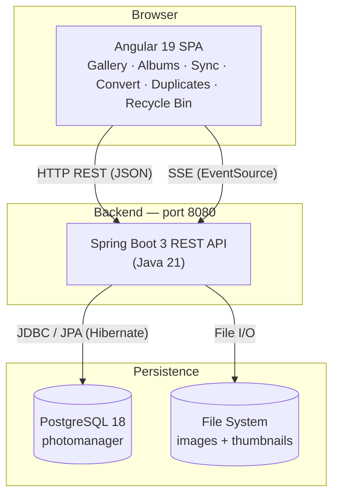
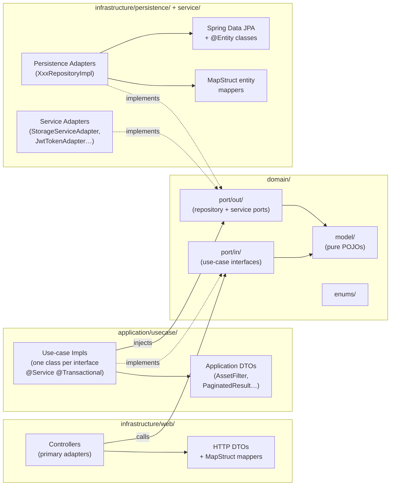
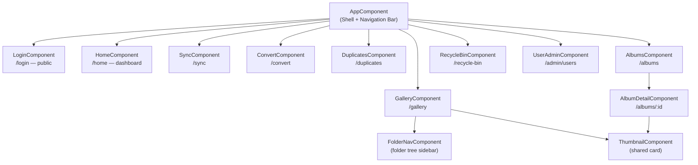
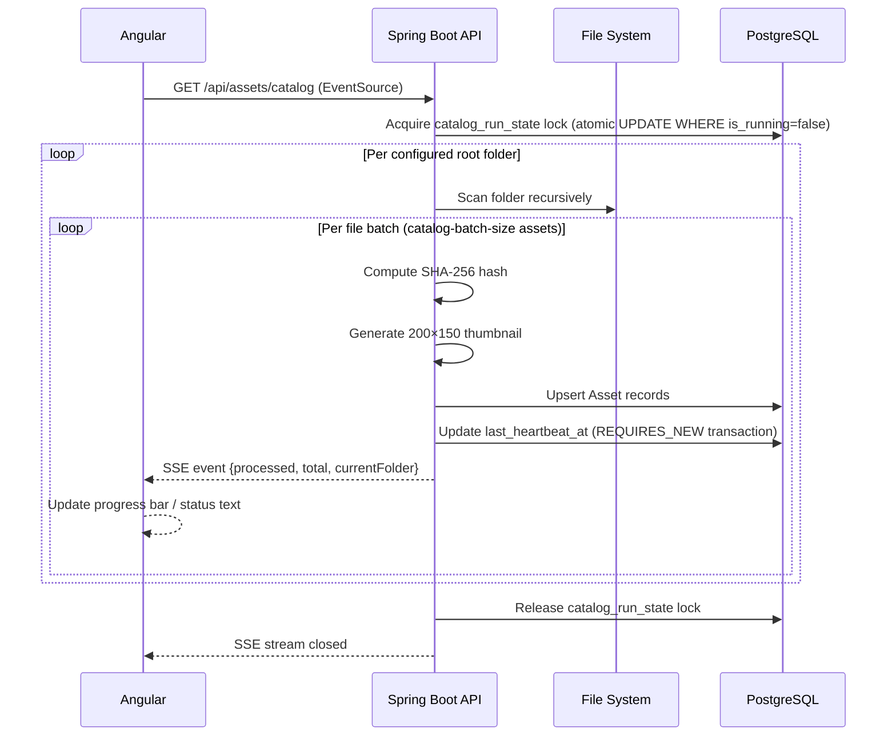

# JP Photo Manager — Web Edition

A web rewrite of the JP Photo Manager desktop application. It replaces the original WPF/.NET application with a modern client–server architecture: a **Java 21 + Spring Boot 3** REST API backend and an **Angular 19** single-page application frontend.

---

## Features

### Gallery

- **Thumbnail grid** — paginated 200×150 thumbnail cards for all images in the selected folder.
- **Full-screen viewer** — double-click any thumbnail to open the original at full resolution with zoom controls; press the grid icon to return.
- **Folder tree navigation** — collapsible sidebar showing the catalogued folder hierarchy; click any folder to load its assets.
- **Search and filter** — filter assets by file name, date range, and minimum star rating.
- **Sort** — sort by file name, creation date, modification date, file size, or rating.
- **Star rating** — rate each image 0–10 stars directly from the thumbnail grid or viewer.
- **EXIF metadata panel** — view camera make and model, ISO, aperture, exposure time, and focal length extracted from image files.
- **Move / copy** — select one or more images and move or copy them to another catalogued folder.
- **Drag-and-drop upload** — drag files from the desktop and drop them onto the gallery to upload them.
- **Download** — download a selection of images as a ZIP archive (up to the configured `max-download-assets` limit).
- **Add to album** — add selected images to an existing album or create a new one on the spot.
- **Soft delete** — deleting images sends them to the Recycle Bin rather than removing them permanently.

### Albums

- Create, rename, and delete personal albums.
- Add or remove individual assets from an album.
- Paginated asset grid within each album, with the same thumbnail viewer as the main gallery.

### Duplicate Detection

- Scans the catalog for images that share the same SHA-256 hash.
- Groups duplicate sets side-by-side for visual comparison.
- Select duplicates to delete; originals are preserved.

### Directory Sync

- Define one or more **source → destination** directory pairs.
- Optional per-pair settings: include sub-folders, delete files from the destination that are no longer in the source.
- Execute the sync and watch live progress streamed via Server-Sent Events.

### PNG → JPEG Conversion

- Define one or more **source → destination** directory pairs for conversion.
- Optional per-pair settings: include sub-folders, delete source PNG after conversion.
- Execute the conversion and watch live progress streamed via Server-Sent Events.

### Recycle Bin

- All deleted images land in the Recycle Bin with a `deleted_at` timestamp (soft delete).
- **Restore** — move images back to their original folder and re-add them to the catalog.
- **Purge** — permanently delete selected images from disk and the database.

### Dashboard

- At-a-glance statistics: total catalogued folders, total assets, combined file size, and average star rating across the library.

### Image Cataloging

- The backend automatically scans all configured root folders on startup and then re-scans after a configurable cooldown (default: 2 minutes).
- Generates 200×150 JPEG thumbnails, computes SHA-256 hashes, and extracts EXIF metadata for every discovered image.
- A distributed lock (`catalog_run_state` table) prevents overlapping runs across multiple backend instances.
- A heartbeat mechanism and stale-run detection recover from crashed catalog processes.

### Real-Time Progress

- Catalog, sync, and convert operations stream live progress events to the browser using **Server-Sent Events** — no polling required.
- Each event carries the number of processed items, the total count, and the current folder being processed.

### Authentication & User Management

- **JWT authentication** via HttpOnly cookie (`SameSite=Strict`) — tokens are never exposed to JavaScript.
- Proactive token refresh (5 minutes before expiry) keeps sessions alive without requiring re-login.
- **User Administration** page (`/admin/users`) — create users, change passwords, and delete users; no self-registration.
- Default administrator account (`admin`/`admin`) is seeded automatically on first startup.

---

## Architecture

### System Architecture



### Backend Hexagonal Architecture

The backend follows **Hexagonal (Ports and Adapters) Architecture** with strict, unidirectional layer dependencies enforced by package naming.



**Dependency flow:** `infrastructure/web → application/usecase → domain ← infrastructure/persistence | infrastructure/service`

The domain layer (`domain/model/`, `domain/port/in/`, `domain/port/out/`) has zero `jakarta.*`, `org.springframework.*`, or infrastructure imports.

Controllers in `infrastructure/web/controller/` delegate directly to use-case interfaces and never touch repositories or service adapters directly.

**Naming conventions:**
- Repository port interfaces: `XxxRepository` (in `domain/port/out/`) → `XxxRepositoryImpl` (in `infrastructure/persistence/adapter/`)
- Service port interfaces: `XxxPort` (in `domain/port/out/`) → `XxxServiceAdapter` (in `infrastructure/service/`)
- All entity↔domain and DTO↔domain conversions go through MapStruct-generated mappers; the `toEntityRef` pattern is used for FK-only references to avoid accidental updates to the referenced row

### Database Schema


### Frontend Component Hierarchy

All routes are lazy-loaded via Angular's `loadComponent()`. Every route except `/login` is protected by `authGuard`, which redirects unauthenticated users to `/login`.



### Project Structure

```
JPPhotoManagerWeb/
├── backend/            # Java 21 + Spring Boot 3 Maven project
│   ├── Dockerfile      # Multi-stage build (Maven → JRE Alpine)
│   └── .dockerignore
├── frontend/           # Angular 19 npm project
│   ├── Dockerfile      # Multi-stage build (Node → Nginx Alpine)
│   ├── nginx.conf      # Serves SPA + reverse-proxies /api to backend
│   └── .dockerignore
├── docker-compose.yml  # Orchestrates db, backend, and frontend
└── .env.example        # Template for local Docker configuration
```

---

## Backend

### Technologies

| Technology | Version |
|---|---|
| Java | 21 |
| Spring Boot | 3.4.4 |
| Spring Web (REST + SSE) | managed by Spring Boot |
| Spring Data JPA | managed by Spring Boot |
| Spring Validation | managed by Spring Boot |
| Spring Actuator | managed by Spring Boot |
| Hibernate (PostgreSQL dialect) | managed by Spring Boot |
| PostgreSQL JDBC | managed by Spring Boot |
| Flyway + Flyway PostgreSQL extension | managed by Spring Boot |
| Lombok | 1.18.46 |
| MapStruct | 1.6.3 |
| Apache Commons Imaging | 1.0-alpha3 |
| GitHub API client | 1.321 |
| JUnit 5 + Mockito + AssertJ | managed by Spring Boot |
| Testcontainers (PostgreSQL) | managed by Spring Boot |

### Internal architecture

The backend follows a clean architecture with strict layering:

```
api/                     → REST controllers and request/response DTOs
application/             → PhotoManagerFacade — central orchestration facade
domain/
  entity/                → JPA entities (Asset, Folder, …)
  enums/                 → ImageRotation, SortCriteria, WallpaperStyle, ReasonEnum
  repository/            → Spring Data JPA repository interfaces
  service/               → Domain service interfaces
infrastructure/
  service/               → Service implementations, StorageServiceImpl, ThumbnailStorageService
config/                  → AppConfig (CORS, async thread pool)
```

**Dependency flow:** `api` → `application` → `domain` ← `infrastructure`

Controllers are thin: they delegate immediately to `PhotoManagerFacade`, which orchestrates all domain services.

### Key services

| Service | Description |
|---|---|
| `CatalogAssetsService` | Recursively scans folders, generates 200×150 thumbnails, computes SHA-256 hashes, persists to DB. Runs asynchronously and streams progress via SSE. |
| `SyncAssetsService` | Copies new files between configured directory pairs; optionally removes files missing from the source. |
| `ConvertAssetsService` | Converts PNG images to JPEG across configured directory pairs. |
| `FindDuplicatedAssetsService` | Groups assets by hash and filters out stale catalog entries. |
| `MoveAssetsService` | Copies or moves files on disk and updates the corresponding DB record. |
| `StorageService` | File I/O, thumbnail generation, EXIF rotation reading (Apache Commons Imaging), SHA-256 hashing. |
| `ThumbnailStorageService` | Stores and retrieves thumbnails as `{assetId}.bin` files under the configured thumbnails directory. |

### Persistence

- **Database:** PostgreSQL 18
- **Schema migrations:** Flyway, scripts in `src/main/resources/db/migration/`
- **ORM:** Spring Data JPA with the Hibernate PostgreSQL dialect
- **Connection:** configured via environment variables `POSTGRES_HOST`, `POSTGRES_PORT`, `POSTGRES_DB`, `POSTGRES_USERNAME`, `POSTGRES_PASSWORD` (defaults: `localhost`, `5432`, `photomanager`, `postgres`, `postgres`)

### REST API

| Method | Path | Description |
|---|---|---|
| `GET` | `/api/assets` | Paginated asset list for a folder (`folderPath`, `page`, `sort`) |
| `GET` | `/api/assets/{id}/thumbnail` | 200×150 JPEG thumbnail |
| `GET` | `/api/assets/{id}/image` | Full-size original image |
| `GET` | `/api/assets/catalog` | SSE stream — catalog progress events |
| `GET` | `/api/assets/duplicates` | Grouped duplicate assets |
| `POST` | `/api/assets/move` | Move or copy assets to a destination folder |
| `DELETE` | `/api/assets` | Remove assets from catalog (optionally delete files) |
| `GET` | `/api/folders` | Catalogued folders, optionally filtered by `parentPath` |
| `GET` | `/api/folders/drives` | Available filesystem roots |
| `GET` | `/api/folders/initial` | Configured initial folder |
| `GET` | `/api/folders/recent-paths` | Recently used destination paths |
| `GET` | `/api/sync/configuration` | Load sync directory pairs |
| `PUT` | `/api/sync/configuration` | Save sync directory pairs |
| `GET` | `/api/sync/run` | SSE stream — run sync and stream status |
| `GET` | `/api/convert/configuration` | Load convert directory pairs |
| `PUT` | `/api/convert/configuration` | Save convert directory pairs |
| `GET` | `/api/convert/run` | SSE stream — run conversion and stream status |

### Configuration

All settings live in `src/main/resources/application.yml`:

| Property | Default | Description |
|---|---|---|
| `server.port` | `8080` | HTTP server port |
| `photomanager.initial-directory` | `~/Pictures` | Starting folder shown in the UI |
| `photomanager.root-catalog-folders` | `~/Pictures` | Semicolon-separated folder roots to catalog |
| `photomanager.catalog-batch-size` | `1000` | Files processed per catalog pass |
| `photomanager.catalog-cooldown-minutes` | `2` | Minimum minutes between catalog runs |
| `photomanager.thumbnails-directory` | `~/.photomanager/thumbnails` | Thumbnail storage path — overridden by `THUMBNAILS_DIR` env var |
| `POSTGRES_HOST` | `localhost` | PostgreSQL host |
| `POSTGRES_PORT` | `5432` | PostgreSQL port |
| `POSTGRES_DB` | `photomanager` | Database name |
| `POSTGRES_USERNAME` | `postgres` | Database user |
| `POSTGRES_PASSWORD` | `postgres` | Database password |
| `CATALOG_DIR` | *(unset — falls back to `~/Pictures`)* | Overrides `initial-directory` and `root-catalog-folders` |
| `THUMBNAILS_DIR` | *(unset — falls back to `~/.photomanager/thumbnails`)* | Overrides `thumbnails-directory` |

### Running the backend

**Prerequisites:** Java 21, Maven 3.9+, PostgreSQL 18 (or Docker)

Start a local PostgreSQL instance if you don't have one:
```bash
docker run -d --name photomanager-db \
  -e POSTGRES_PASSWORD=postgres \
  -e POSTGRES_DB=photomanager \
  -p 5432:5432 postgres:18
```

```bash
cd JPPhotoManagerWeb/backend

# Build
mvn clean package -DskipTests

# Run
mvn spring-boot:run
```

The API starts at `http://localhost:8080`.

The interactive API documentation (Swagger UI) is available at `http://localhost:8080/swagger-ui.html`. The raw OpenAPI JSON spec is at `http://localhost:8080/v3/api-docs`. Both endpoints are accessible without authentication.

### Running backend tests

```bash
cd JPPhotoManagerWeb/backend

# All tests
mvn test

# Single test class
mvn test -Dtest=CatalogAssetsServiceImplTest

# Single test method
mvn test -Dtest=CatalogAssetsServiceImplTest#methodName
```

Tests use the `test` Spring profile (`src/test/resources/application-test.yml`). Unit tests (`@ExtendWith(MockitoExtension.class)`, `@WebMvcTest`) need no database. Integration tests (`@SpringBootTest`) use Testcontainers to spin up a real PostgreSQL container automatically — Docker must be running.

> **Linux tip:** If integration tests are skipped with a Testcontainers "no valid configuration" error, your user may not have permission to reach the Docker socket. Add yourself to the `docker` group and apply it immediately:
> ```bash
> sudo usermod -aG docker $USER
> newgrp docker
> ```
> The `newgrp` command activates the new group in your current shell without requiring a full logout.

---

## Frontend

### Technologies

| Technology | Version |
|---|---|
| Angular | 19 |
| Angular Material | 19 |
| Angular CDK | 19 |
| TypeScript | 5.6 |
| RxJS | 7.8 |
| Node.js (build/dev) | 22 |
| Karma + Jasmine | 6.4 / 5.4 |

### Application structure

```
src/app/
  app.component.ts/html/scss   → Shell with top navigation bar
  app.routes.ts                → Lazy routes: /gallery, /sync, /convert, /duplicates
  app.config.ts                → ApplicationConfig (HttpClient, Router, Animations)
  core/
    models/                    → TypeScript interfaces (Asset, Folder, PaginatedData, …)
    services/                  → Angular services wrapping the backend REST API
  features/
    gallery/                   → Thumbnail grid + full-size image viewer
    folder-nav/                → Folder tree (Angular CDK FlatTreeControl)
    sync/                      → Sync configuration and execution
    convert/                   → Convert configuration and execution
    duplicates/                → Duplicate detection and cleanup
  shared/
    components/thumbnail/      → Reusable thumbnail card component
    pipes/file-size.pipe.ts    → Human-readable file size formatting
```

All components are **standalone** (no NgModules). Routes are lazy-loaded:

| Path | Feature | Description |
|---|---|---|
| `/` | — | Redirects to `/gallery` |
| `/gallery` | Gallery | Paginated thumbnail grid and full-size viewer |
| `/sync` | Sync | Configure and run directory sync |
| `/convert` | Convert | Configure and run PNG→JPEG conversion |
| `/duplicates` | Duplicates | Find and remove duplicate images |

### Gallery modes

- **Thumbnails mode** — paginated grid; each card displays a 200×150 thumbnail fetched from `/api/assets/{id}/thumbnail`.
- **Viewer mode** — full-screen; loads the original file from `/api/assets/{id}/image` with zoom controls. Double-click a thumbnail to enter viewer mode; click the grid icon to return.

### Real-time progress

Long-running operations (catalog, sync, convert) use the browser's native `EventSource` API to consume SSE streams from the backend, displaying live progress without polling.

**SSE (Server-Sent Events)** is a web standard where the server pushes a stream of text events to the client over a single long-lived HTTP connection. It is one-way (server → client only), HTTP-based — the client makes a regular `GET` request and the response stays open while the server writes `data: ...` lines as events occur — and browsers handle reconnection automatically if the connection drops.



### Running the frontend

**Prerequisites:** Node.js 22, npm

```bash
cd JPPhotoManagerWeb/frontend

# Install dependencies
npm install

# Run development server (proxies /api to localhost:8080)
npm start
```

The app is available at `http://localhost:4200`. The dev server automatically proxies `/api` requests to the backend.

#### Development proxy

All frontend services use **relative paths** (`/api/assets`, `/api/folders`, …) rather than hardcoded ports. During development, Angular's dev server forwards every `/api` request to the Spring Boot backend via `proxy.conf.json`:

```json
{
  "/api": {
    "target": "http://localhost:8080",
    "secure": false,
    "changeOrigin": true
  }
}
```

The browser only ever contacts port **4200** (the `ng serve` dev server's default port); the proxy rewrites and forwards the request to port **8080** on the server side. Port 4200 is a local-development-only detail — the Docker Compose setup exposes the app on port **80** via nginx instead. This means:

- No CORS headers are needed in development — both the HTML page and the API responses come from the same origin (`localhost:4200`).
- Image `` tags, `EventSource` SSE connections, and `HttpClient` calls all work automatically because the browser always uses the same origin.
- Changing the backend port only requires updating `proxy.conf.json` — no source code change.

In production the Angular build produces a static bundle that is served by **nginx** (`nginx.conf`), which applies the identical routing rule:

```nginx
location /api/ {
    proxy_pass http://backend:8080/api/;
}
```

### Building for production

```bash
cd JPPhotoManagerWeb/frontend
npm run build:prod
```

Output goes to `dist/jp-photo-manager-ui/`.

### Running frontend tests

```bash
cd JPPhotoManagerWeb/frontend
npm test

# Headless (CI)
npm test -- --watch=false --browsers=ChromeHeadless
```

---

## Running with Docker Compose

The fastest way to run the full stack. No local Java, Maven, Node.js, or PostgreSQL installation required.

### Prerequisites

- Docker 24+
- Docker Compose v2 (`docker compose` — not the legacy `docker-compose`)

### Setup

1. Copy the environment template and fill in your values:
   ```bash
   cd JPPhotoManagerWeb
   cp .env.example .env
   ```

2. Edit `.env` — the only required change is `HOST_IMAGE_DIR`:

   | Variable | Description |
   |---|---|
   | `HOST_IMAGE_DIR` | **Required.** Absolute path on your machine to the directory containing images to catalogue (e.g. `/home/yourname/Pictures`). Mounted read-write so all write features work on your actual files. |
   | `JWT_SECRET` | **Required.** HS256 signing secret. Generate with `openssl rand -base64 32`. |
   | `POSTGRES_DB` | Database name (default: `photomanager`). |
   | `POSTGRES_USERNAME` | Database user (default: `postgres`). |
   | `POSTGRES_PASSWORD` | Database password (default: `postgres`). |

3. Build and start all three services:
   ```bash
   docker compose up --build
   ```

4. Open `http://localhost` in your browser.

### First-time migration (existing catalog)

If you have an existing catalog in a **host PostgreSQL instance** and want to move it into the Docker Compose stack, run the migration script **once** before switching over.

**When to run:** only if you previously ran the backend against a host PostgreSQL installation (not the Compose stack) and want to preserve your catalog data.

**Steps:**

1. Make sure your host PostgreSQL is running and the backend is stopped.

2. From the `JPPhotoManagerWeb/` directory, run the script:
   ```bash
   cd JPPhotoManagerWeb
   ./migrate-db.sh
   ```
   The script dumps your host database, starts only the `db` container, waits for it to be ready, and restores the dump. Pass environment variables to override the defaults:
   ```bash
   PGHOST=localhost PGPORT=5432 PGUSER=postgres PGDATABASE=photomanager ./migrate-db.sh
   ```

3. Once the script prints "Migration successful!", stop your host PostgreSQL service:
   ```bash
   # Linux (systemd)
   sudo systemctl stop postgresql

   # macOS (Homebrew)
   brew services stop postgresql
   ```

4. Start the full stack:
   ```bash
   docker compose up --build
   ```

> **Rollback:** if anything goes wrong, the host database is untouched — the script only reads from it. Simply restart your host PostgreSQL and backend without the Compose stack.

### Services

| Service | Container | Host port | Description |
|---|---|---|---|
| `db` | `postgres:18` | `5433` | PostgreSQL 18; data persisted in the `pgdata` named volume |
| `backend` | JRE 21 Alpine | `8080` | Spring Boot REST API; `HOST_IMAGE_DIR` bind-mounted at `/catalog` |
| `frontend` | Nginx Alpine | `80` | Angular SPA; reverse-proxies `/api` to the backend |
| `prometheus` | `prom/prometheus` | `9090` | Scrapes backend metrics from `/actuator/prometheus` every 15 s |
| `grafana` | `grafana/grafana` | `3000` | Dashboard UI backed by Prometheus |

### Accessing services from the host

After `docker compose up`, all services are reachable from the host machine:

| Service | URL / address | Default credentials |
|---|---|---|
| Frontend (Angular SPA) | `http://localhost` | `admin` / `admin` — change after first login |
| Backend REST API | `http://localhost:8080/api` | JWT cookie set on login |
| Swagger UI | `http://localhost:8080/swagger-ui.html` | — |
| PostgreSQL | `localhost:5433` | see table below |
| Prometheus | `http://localhost:9090` | — |
| Grafana | `http://localhost:3000` | `admin` / value of `GRAFANA_ADMIN_PASSWORD` (default: `admin`) |

#### Connecting DBeaver to the database

Create a new **PostgreSQL** connection in DBeaver with the following settings:

| Field | Value |
|---|---|
| Host | `localhost` |
| Port | `5433` |
| Database | `photomanager` (or the value of `POSTGRES_DB` in your `.env`) |
| Username | `postgres` (or `POSTGRES_USERNAME`) |
| Password | `postgres` (or `POSTGRES_PASSWORD`) |
| SSL | disabled |

Steps:
1. Open DBeaver → **Database** menu → **New Database Connection**.
2. Select **PostgreSQL** and click **Next**.
3. Fill in the fields from the table above and click **Test Connection** to verify.
4. Click **Finish**.

#### Calling the backend API directly from the host

With port 8080 exposed you can hit the REST API directly — useful for testing with curl or tools like Insomnia:

```bash
# Log in and capture the jwt cookie
curl -c cookies.txt -X POST http://localhost:8080/api/auth/login \
  -H "Content-Type: application/json" \
  -d '{"username":"admin","password":"admin"}'

# Use the cookie to call a protected endpoint
curl -b cookies.txt http://localhost:8080/api/folders
```

### Monitoring (Grafana + Prometheus)

After `docker compose up`, Grafana is available at **`http://localhost:3000`**.

**First-time login:**

| Field | Value |
|---|---|
| Username | `admin` |
| Password | value of `GRAFANA_ADMIN_PASSWORD` in your `.env` (default: `admin`) |

Set `GRAFANA_ADMIN_PASSWORD` in `.env` before the first run. Changing it afterwards has no effect because Grafana stores the password in its persistent volume — update the password via the UI instead, or delete the `grafana_data` volume to reset.

**Persistence:** Grafana stores all configuration (dashboards, data sources, users) in a named Docker volume (`grafana_data`) so nothing is lost across container restarts or `docker compose down` (without `--volumes`).

**Pre-configured data source and dashboards:** The Prometheus data source (`http://prometheus:9090`) and the following dashboards are provisioned automatically from `grafana/provisioning/` — no manual setup required.

| Dashboard | Grafana ID | What it covers |
|---|---|---|
| JP Photo Manager | (custom) | HTTP rate, latency, JVM heap, CPU, Spring Batch catalog job |
| JVM (Micrometer) | 4701 | GC pauses, memory pools, threads, classloading, buffer pools |
| Spring Boot 3.x Statistics | 19004 | Basic stats, CPU, load average, JVM memory/GC, HikariCP pool, HTTP server stats, Logback |

**Explore metrics:**

The backend exposes Spring Boot Actuator metrics at `/actuator/prometheus`. Key metric families:

| Metric prefix | Description |
|---|---|
| `http_server_requests_*` | HTTP request counts, error rates, and latencies |
| `jvm_memory_*` | JVM heap and non-heap memory usage |
| `jvm_gc_*` | Garbage collection pause times and counts |
| `process_cpu_*` | JVM process CPU usage |
| `hikaricp_*` | Database connection pool utilisation |

You can also query Prometheus directly at **`http://localhost:9090`**.

**Create a dashboard manually:**

1. Go to **Dashboards → New → New dashboard → Add visualization**.
2. Select your Prometheus data source.
3. In the query editor, switch to **Code** mode and enter a PromQL expression. Useful starting points:

| What you want to see | PromQL |
|---|---|
| HTTP request rate (req/s) | `rate(http_server_requests_seconds_count[1m])` |
| HTTP error rate (5xx) | `rate(http_server_requests_seconds_count{status=~"5.."}[1m])` |
| P99 request latency | `histogram_quantile(0.99, rate(http_server_requests_seconds_bucket[5m]))` |
| JVM heap used | `jvm_memory_used_bytes{area="heap"}` |
| GC pause time rate | `rate(jvm_gc_pause_seconds_sum[1m])` |
| DB connection pool active | `hikaricp_connections_active` |

4. Choose a visualization type (Time series, Gauge, Stat, …), set a title, and click **Apply**.
5. Repeat for each metric, then **Save dashboard**.

**Troubleshooting:**

*Prometheus target shows "Error scraping target: server returned HTTP status 500"*

The backend `GlobalExceptionHandler` has a catch-all `Exception` handler that intercepts `NoResourceFoundException` thrown when the `/actuator/prometheus` endpoint is not registered. Check the backend logs:

```bash
docker compose logs backend | grep -i "error\|exception\|actuator"
```

If you see `NoResourceFoundException: No static resource actuator/prometheus`, the `micrometer-registry-prometheus` JAR is missing from the running fat JAR — the container is using a stale image built before that dependency was added to `pom.xml`. Verify:

```bash
docker compose exec backend sh -c "unzip -l app.jar | grep micrometer"
```

If `micrometer-registry-prometheus-*.jar` does not appear, rebuild the backend image from scratch and force the container to use it:

```bash
docker compose build --no-cache backend
docker compose up -d --force-recreate backend
```

Note: `docker compose up --build` reuses Docker layer cache for the `mvn dependency:go-offline` step if `pom.xml` has not changed on disk. If the dependency is still missing after that, `--no-cache` + `--force-recreate` guarantees a clean build and a new container.

Confirm the endpoint is now registered:

```bash
docker compose exec backend wget -qO- http://localhost:8080/actuator
```

`prometheus` must appear in the `_links` object before Prometheus can scrape it.

*Grafana panels show "No data" even though the Prometheus target is UP*

Check that the Prometheus data source URL in Grafana is `http://prometheus:9090`, not `http://localhost:9090`. From inside the Grafana container, `localhost` resolves to Grafana itself, not to Prometheus. The Docker service name `prometheus` is the correct hostname.

Verify end-to-end connectivity with this minimal query in any Grafana panel:

```promql
up{job="photomanager-backend"}
```

A result of `1` means the full pipeline — Grafana → Prometheus → backend — is working.

### Volume behaviour

| Volume | Type | Description |
|---|---|---|
| `pgdata` | Named Docker volume | PostgreSQL data — survives `docker compose down`, removed by `docker compose down -v` |
| `thumbnails` | Named Docker volume | Generated thumbnail files — survives `docker compose down`, removed by `docker compose down -v` |
| `HOST_IMAGE_DIR` | Bind mount (read-write) | Your photos directory — changes made by the app are reflected on your host filesystem |

### Common commands

```bash
# Start (build images on first run or after code changes)
docker compose up --build

# Start without rebuilding
docker compose up

# Rebuild and restart a single service (e.g. after editing frontend or backend source)
docker compose up --build frontend
docker compose up --build backend

# Stop (keeps volumes — data preserved)
docker compose down

# Stop and wipe all volumes (full reset — deletes DB and thumbnails)
docker compose down -v

# View logs for a specific service
docker compose logs -f backend
```

### Linux file permission note

If write operations (delete, move, convert) fail with `AccessDeniedException`, the container user's UID doesn't match the owner of `HOST_IMAGE_DIR`. Fix by adding `user` to the `backend` service in `docker-compose.yml`:

```yaml
backend:
  user: "${UID}:${GID}"
```

Then start with:
```bash
UID=$(id -u) GID=$(id -g) docker compose up
```

---

## Running the full application (without Docker)

1. Start the backend:
   ```bash
   cd JPPhotoManagerWeb/backend
   mvn spring-boot:run
   ```

2. In a separate terminal, start the frontend dev server:
   ```bash
   cd JPPhotoManagerWeb/frontend
   npm install
   npm start
   ```

3. Open `http://localhost:4200` in your browser.

---

## CI/CD

Two GitHub Actions workflows are defined in `.github/workflows/`:

| Workflow | File | Trigger |
|---|---|---|
| Web Test | `web-test.yml` | Every push and pull request |
| Web Release | `web-release.yml` | Tags matching `web-v*` |

Each workflow has separate jobs for the backend (Java 21 + Maven) and frontend (Node 22 + npm). The release workflow additionally creates a GitHub Release with the JAR and a zipped frontend dist as artifacts.

---

## Catalog Process

The catalog process scans all configured root folders (`photomanager.root-catalog-folders`), generates thumbnails, computes SHA-256 hashes, and persists asset metadata to the database.

### Lifecycle

The backend owns the catalog lifecycle entirely. The gallery frontend no longer triggers catalog runs on page load.

**Startup:** `CatalogScheduler` listens for `ApplicationReadyEvent` and immediately submits the first catalog run to a dedicated single-thread `ThreadPoolTaskScheduler`.

**Periodic repetition:** After each run completes, the scheduler waits `photomanager.catalog-cooldown-minutes` (default: 2 minutes) before starting the next run. The delay is measured from the **end** of the previous run (fixed delay, not fixed rate), so runs never overlap.

**Manual trigger:** The `GET /api/assets/catalog` SSE endpoint remains available for manual or troubleshooting use. If a run is already in progress the request is silently skipped and the SSE stream completes immediately.

### Distributed Lock

A single-row `catalog_run_state` table acts as a distributed lock across all JVM instances:

| Column | Type | Description |
|---|---|---|
| `id` | integer (always 1) | Single-row primary key |
| `is_running` | boolean | Whether a run is active |
| `started_at` | timestamptz | When the current run started |
| `last_heartbeat_at` | timestamptz | Last heartbeat from the running instance |
| `instance_id` | varchar | UUID of the JVM that holds the lock |

Before each run the backend executes an atomic `UPDATE … WHERE id=1 AND is_running=false`. Only one instance succeeds; all others skip. The lock is released in a `finally` block using `WHERE instance_id = :thisInstance` to avoid accidentally releasing another instance's lock.

### Heartbeat

To keep long-running catalog runs alive, `last_heartbeat_at` is refreshed after every `photomanager.catalog-batch-size` (default: 1000) assets are saved. The heartbeat update runs in its own transaction (`propagation = REQUIRES_NEW`) so it is immediately visible to all JVM instances, even while the enclosing folder transaction is still open.

### Stale Run Detection

A `@Scheduled` task runs every 60 seconds. It computes `threshold = now - catalog-timeout minutes` (default: 60 minutes) and:

1. If this JVM holds the lock and `last_heartbeat_at < threshold`: interrupts the catalog thread and releases the DB lock.
2. Releases any locks held by other (crashed) instances whose heartbeat is also older than the threshold.

The catalog folder loop checks `Thread.currentThread().isInterrupted()` at the start of each folder iteration and returns early if set, ensuring clean shutdown on interruption.

### Configuration

| Property | Default | Description |
|---|---|---|
| `photomanager.catalog-cooldown-minutes` | `2` | Minutes to wait between catalog runs (fixed delay from end of previous run) |
| `photomanager.catalog-batch-size` | `1000` | Assets saved between heartbeat refreshes |
| `photomanager.catalog-timeout` | `60` | Minutes without a heartbeat before a run is considered stale |

---

## Logging

Application logs are written to two outputs simultaneously:

- **File:** `~/.photomanager/logs/photomanager.log` — structured **JSON** format (one JSON object per line, using `logstash-logback-encoder`). Each entry includes `@timestamp`, `level`, `logger_name`, `thread_name`, `message`, and any MDC fields or exception details.
- **Console:** human-readable plain-text format (`yyyy-MM-dd HH:mm:ss.SSS [thread] LEVEL logger - message`).

### Log rotation

Logs rotate **daily**. Rotated files are compressed and stored alongside the active log file as `photomanager.log.yyyy-MM-dd.gz`. Files older than **30 days** are deleted automatically.

### Configuration

Logging is configured entirely via `src/main/resources/logback-spring.xml`. The `logging.*` properties in `application.yml` have no effect while `logback-spring.xml` is present — all tuning must happen in that file.

---

## Authentication

The application uses **JWT stored in an HttpOnly cookie** (`SameSite=Strict`, `Path=/`). All `/api/**` endpoints except `POST /api/auth/login` require this cookie. Because the browser attaches cookies automatically to every same-origin request — including `` image loads and the native `EventSource` API — no custom `Authorization` header is needed and there is no risk of token theft via JavaScript.

### Public endpoint

| Method | Path | Description |
|---|---|---|
| `POST` | `/api/auth/login` | Authenticate; sets `jwt` HttpOnly cookie and returns `{ "username": "...", "expiresAt": "..." }` |

### JWT flow

```mermaid
sequenceDiagram
    participant User
    participant Angular
    participant API as Spring Boot API
    participant DB as PostgreSQL

    User->>Angular: Navigate to protected route
    Angular->>Angular: authGuard checks localStorage for session
    Angular-->>User: Redirect to /login (no valid session)

    User->>Angular: Submit credentials
    Angular->>API: POST /api/auth/login {username, password}
    API->>DB: Look up user, verify BCrypt hash
    DB-->>API: User record
    API-->>Angular: Set-Cookie: jwt=<token> (HttpOnly, SameSite=Strict) + {username, expiresAt}
    Angular->>Angular: Store {username, expiresAt} in localStorage
    Angular->>Angular: Schedule proactive refresh at (expiresAt − 5 min)
    Angular-->>User: Redirect to /home

    Note over Angular,API: Cookie is sent automatically with every subsequent request

    Angular->>API: GET /api/assets (cookie sent by browser)
    API->>API: JwtAuthenticationFilter validates cookie
    API-->>Angular: 200 OK + data

    Angular->>API: POST /api/auth/logout
    API-->>Angular: Set-Cookie: jwt=; Max-Age=0 (clears cookie)
    Angular->>Angular: Clear localStorage + cancel refresh timer
    Angular-->>User: Redirect to /login
```

### Configuration properties

| Property | Default | Description |
|---|---|---|
| `photomanager.jwt-secret` | *(empty — must be set)* | HS256 signing secret (≥ 32 bytes) |
| `photomanager.jwt-expiry-hours` | `24` | Token validity in hours |

### Setup (local development)

1. Copy `src/main/resources/application-local.yml.example` to `src/main/resources/application-local.yml`
2. Generate a secure secret:
   ```bash
   openssl rand -base64 32
   ```
3. Paste the output into `photomanager.jwt-secret` in `application-local.yml`

> **Important:** The application **will not start** if `photomanager.jwt-secret` is blank. `application-local.yml` is git-ignored and must never be committed.

### Setup (Docker Compose)

Set `JWT_SECRET` in `JPPhotoManagerWeb/.env`:
```bash
echo "JWT_SECRET=$(openssl rand -base64 32)" >> JPPhotoManagerWeb/.env
```

### Default admin user

On first startup, if no users exist in the database, the application automatically creates a default administrator:

| Username | Password |
|---|---|
| `admin` | `admin` |

**Change this password immediately** after first login using the **User Administration** page (`/admin/users`).

### User Administration

Navigate to **Users** in the navigation bar (or `/admin/users`) to:
- View all users
- Add new users
- Change a user's password
- Delete users

There is no self-registration; all user management is done by an authenticated administrator.

---

## curl Command Reference

All commands below assume the backend is reachable at `http://localhost:8080`.  
Authentication uses **HttpOnly cookies** — `curl` handles them automatically via the `-c`/`-b` flags.

```bash
# Save cookies to a file after login (run this first)
curl -c cookies.txt -s -o /dev/null -w "%{http_code}" \
  -X POST http://localhost:8080/api/auth/login \
  -H "Content-Type: application/json" \
  -d '{"username":"admin","password":"admin"}'
# → 200

# All subsequent requests use -b cookies.txt to send the jwt cookie
```

---

### Authentication

```bash
# Log in — sets jwt and refreshToken cookies
curl -c cookies.txt -X POST http://localhost:8080/api/auth/login \
  -H "Content-Type: application/json" \
  -d '{"username":"admin","password":"admin"}'

# Refresh the JWT using the refresh-token cookie (rotates both cookies)
curl -c cookies.txt -b cookies.txt \
  -X POST http://localhost:8080/api/auth/refresh

# Log out — clears both cookies server-side
curl -b cookies.txt -X POST http://localhost:8080/api/auth/logout
```

---

### Folders

```bash
# List all catalogued folders
curl -b cookies.txt http://localhost:8080/api/folders

# List folders under a specific parent
curl -b cookies.txt "http://localhost:8080/api/folders?parentPath=/home/user/Pictures"

# List available filesystem roots (drives)
curl -b cookies.txt http://localhost:8080/api/folders/drives

# Get the configured initial folder
curl -b cookies.txt http://localhost:8080/api/folders/initial

# Get recently used destination paths (used by the move dialog)
curl -b cookies.txt http://localhost:8080/api/folders/recent-paths
```

---

### Assets

```bash
# List assets in a folder (page 0, default sort)
curl -b cookies.txt \
  "http://localhost:8080/api/assets?folderPath=/home/user/Pictures&page=0"

# List assets with all filter options
curl -b cookies.txt \
  "http://localhost:8080/api/assets?folderPath=/home/user/Pictures&page=0&sort=FILE_CREATION_DATE_TIME&search=sunset&dateFrom=2024-01-01&dateTo=2024-12-31&minRating=3&tags=vacation"

# Available sort values:
#   FILE_NAME | FILE_SIZE | FILE_CREATION_DATE_TIME
#   FILE_MODIFICATION_DATE_TIME | THUMBNAIL_CREATION_DATE_TIME | RATING

# List assets grouped by date (timeline view)
curl -b cookies.txt \
  "http://localhost:8080/api/assets/timeline?folderPath=/home/user/Pictures&page=0"

# Download a thumbnail (200×150 JPEG) — save to file
curl -b cookies.txt \
  "http://localhost:8080/api/assets/1/thumbnail" -o thumbnail.jpg

# Download the full-size original image
curl -b cookies.txt \
  "http://localhost:8080/api/assets/1/image" -o original.jpg

# Get EXIF metadata for an asset
curl -b cookies.txt http://localhost:8080/api/assets/1/exif

# Rate an asset (0–5 stars; 0 clears the rating)
curl -b cookies.txt -X PATCH http://localhost:8080/api/assets/1/rating \
  -H "Content-Type: application/json" \
  -d '{"rating":4}'

# Move assets to another folder
curl -b cookies.txt -X POST http://localhost:8080/api/assets/move \
  -H "Content-Type: application/json" \
  -d '{"assetIds":[1,2,3],"destinationFolderPath":"/home/user/Pictures/Archive","preserveOriginal":false}'

# Copy assets (preserveOriginal: true)
curl -b cookies.txt -X POST http://localhost:8080/api/assets/move \
  -H "Content-Type: application/json" \
  -d '{"assetIds":[1,2],"destinationFolderPath":"/home/user/Backup","preserveOriginal":true}'

# Download assets as a ZIP archive — save to file
curl -b cookies.txt -X POST http://localhost:8080/api/assets/download \
  -H "Content-Type: application/json" \
  -d '{"assetIds":[1,2,3]}' -o assets.zip

# Remove assets from the catalog only (files kept on disk)
curl -b cookies.txt -X DELETE \
  "http://localhost:8080/api/assets?assetIds=1&assetIds=2"

# Delete assets from the catalog AND delete the files on disk
curl -b cookies.txt -X DELETE \
  "http://localhost:8080/api/assets?assetIds=1&assetIds=2&deleteFiles=true"

# Get grouped duplicate assets
curl -b cookies.txt http://localhost:8080/api/assets/duplicates

# Upload a file into a folder
curl -b cookies.txt -X POST http://localhost:8080/api/assets/upload \
  -F "file=@/home/user/photo.jpg" \
  -F "folderPath=/home/user/Pictures/Imported"
```

---

### Catalog

The catalog endpoint streams Server-Sent Events. Use `curl -N` (no buffering) to see events as they arrive.

```bash
# Start cataloguing all configured root folders and stream progress
curl -b cookies.txt -N http://localhost:8080/api/assets/catalog
# Events arrive as:  data: {"reason":"ASSET_CREATED","asset":{...}}
# The stream closes automatically when cataloguing is complete.
```

---

### Tags

```bash
# Search tag suggestions (returns tags matching a prefix)
curl -b cookies.txt "http://localhost:8080/api/tags?q=vac"

# Add a tag to a single asset
curl -b cookies.txt -X POST http://localhost:8080/api/assets/1/tags \
  -H "Content-Type: application/json" \
  -d '{"name":"vacation"}'

# Remove a tag from a single asset
curl -b cookies.txt -X DELETE \
  "http://localhost:8080/api/assets/1/tags?name=vacation"

# Add a tag to multiple assets at once
curl -b cookies.txt -X POST http://localhost:8080/api/assets/tags/bulk \
  -H "Content-Type: application/json" \
  -d '{"assetIds":[1,2,3],"name":"vacation"}'

# Remove a tag from multiple assets at once
curl -b cookies.txt -X DELETE http://localhost:8080/api/assets/tags/bulk \
  -H "Content-Type: application/json" \
  -d '{"assetIds":[1,2,3],"name":"vacation"}'
```

---

### Albums

```bash
# List all albums
curl -b cookies.txt http://localhost:8080/api/albums

# Create an album
curl -b cookies.txt -X POST http://localhost:8080/api/albums \
  -H "Content-Type: application/json" \
  -d '{"name":"Summer 2024","description":"Beach photos"}'

# Get an album's assets (paginated)
curl -b cookies.txt "http://localhost:8080/api/albums/1?page=0"

# Rename / update an album
curl -b cookies.txt -X PUT http://localhost:8080/api/albums/1 \
  -H "Content-Type: application/json" \
  -d '{"name":"Summer 2024 — Best Of","description":"Curated selection"}'

# Add assets to an album
curl -b cookies.txt -X POST http://localhost:8080/api/albums/1/assets \
  -H "Content-Type: application/json" \
  -d '{"assetIds":[1,2,3]}'

# Remove assets from an album
curl -b cookies.txt -X DELETE http://localhost:8080/api/albums/1/assets \
  -H "Content-Type: application/json" \
  -d '{"assetIds":[2]}'

# Delete an album
curl -b cookies.txt -X DELETE http://localhost:8080/api/albums/1
```

---

### Search Presets

```bash
# List all saved search presets
curl -b cookies.txt http://localhost:8080/api/search-presets

# Save the current filters as a preset
curl -b cookies.txt -X POST http://localhost:8080/api/search-presets \
  -H "Content-Type: application/json" \
  -d '{"name":"Vacation 3-star","search":"vacation","dateFrom":"2024-06-01","dateTo":"2024-08-31","minRating":3}'

# Delete a preset
curl -b cookies.txt -X DELETE http://localhost:8080/api/search-presets/1
```

---

### Recycle Bin

```bash
# List soft-deleted assets (page 0)
curl -b cookies.txt "http://localhost:8080/api/recycle-bin?page=0"

# Restore specific assets from the recycle bin
curl -b cookies.txt -X POST http://localhost:8080/api/recycle-bin/restore \
  -H "Content-Type: application/json" \
  -d '{"assetIds":[1,2]}'

# Purge specific assets permanently
curl -b cookies.txt -X DELETE http://localhost:8080/api/recycle-bin \
  -H "Content-Type: application/json" \
  -d '{"assetIds":[3,4]}'

# Purge ALL deleted assets permanently (empty body)
curl -b cookies.txt -X DELETE http://localhost:8080/api/recycle-bin
```

---

### Sync

```bash
# Get current sync configuration
curl -b cookies.txt http://localhost:8080/api/sync/configuration

# Save sync configuration (list of directory pairs)
curl -b cookies.txt -X PUT http://localhost:8080/api/sync/configuration \
  -H "Content-Type: application/json" \
  -d '[{"sourceDirectory":"/home/user/Pictures","destinationDirectory":"/backup/Pictures","includeSubFolders":true,"deleteAssetsNotInSource":false,"order":1}]'

# Run sync and stream progress events
curl -b cookies.txt -N http://localhost:8080/api/sync/run
```

---

### Convert

```bash
# Get current convert configuration
curl -b cookies.txt http://localhost:8080/api/convert/configuration

# Save convert configuration (PNG → JPEG directory pairs)
curl -b cookies.txt -X PUT http://localhost:8080/api/convert/configuration \
  -H "Content-Type: application/json" \
  -d '[{"sourceDirectory":"/home/user/Pictures/Raw","destinationDirectory":"/home/user/Pictures/JPEG","includeSubFolders":false,"deleteAssetsNotInSource":false,"order":1}]'

# Run convert and stream progress events
curl -b cookies.txt -N http://localhost:8080/api/convert/run
```

---

### Media streaming

```bash
# Stream an audio asset (returns the audio file bytes)
curl -b cookies.txt "http://localhost:8080/api/assets/1/stream" -o track.mp3

# Get the asset list for a playlist asset
curl -b cookies.txt http://localhost:8080/api/audio/playlist/5
```

---

### Home / Dashboard

```bash
# Get dashboard statistics (total assets, folders, duplicates, etc.)
curl -b cookies.txt http://localhost:8080/api/home/stats
```

---

### User Administration

These endpoints require an authenticated administrator account.

```bash
# List all users
curl -b cookies.txt http://localhost:8080/api/admin/users

# Create a new user
curl -b cookies.txt -X POST http://localhost:8080/api/admin/users \
  -H "Content-Type: application/json" \
  -d '{"username":"alice","password":"s3cr3t!"}'

# Change a user's password (replace UUID with the actual user id)
curl -b cookies.txt -X PATCH \
  http://localhost:8080/api/admin/users/a1b2c3d4-e5f6-7890-abcd-ef1234567890/password \
  -H "Content-Type: application/json" \
  -d '{"password":"newpassword"}'

# Delete a user
curl -b cookies.txt -X DELETE \
  http://localhost:8080/api/admin/users/a1b2c3d4-e5f6-7890-abcd-ef1234567890
```
