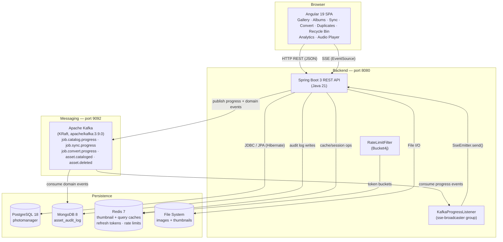
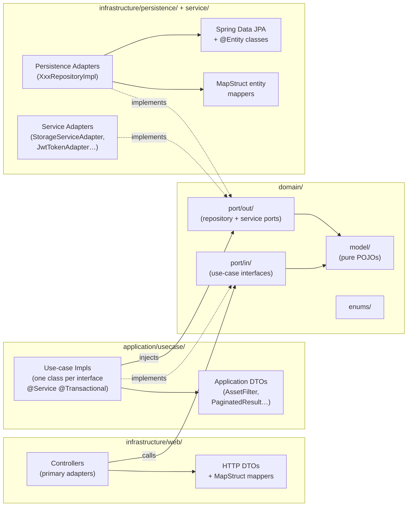
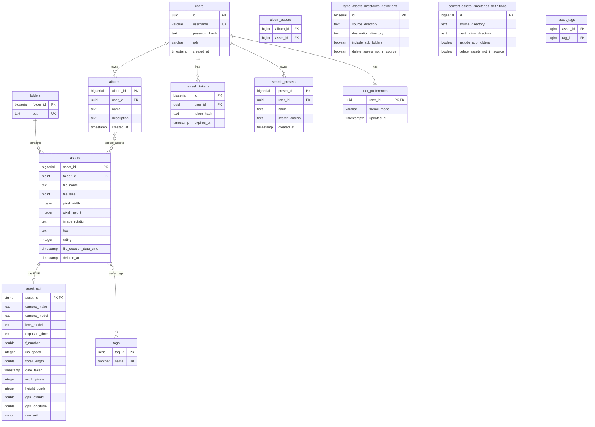
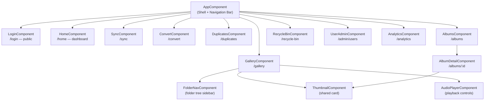

[← Back to README](../README.md)

# Architecture

## System Architecture



## Backend Hexagonal Architecture

The backend follows **Hexagonal (Ports and Adapters) Architecture** with strict, unidirectional layer dependencies enforced by package naming.



**Dependency flow:** `infrastructure/web → application/usecase → domain ← infrastructure/persistence | infrastructure/service`

The domain layer (`domain/model/`, `domain/port/in/`, `domain/port/out/`) has zero `jakarta.*`, `org.springframework.*`, or infrastructure imports.

Controllers in `infrastructure/web/controller/` delegate directly to use-case interfaces and never touch repositories or service adapters directly.

**Naming conventions:**
- Repository port interfaces: `XxxRepository` (in `domain/port/out/`) → `XxxRepositoryImpl` (in `infrastructure/persistence/adapter/`)
- Service port interfaces: `XxxPort` (in `domain/port/out/`) → `XxxServiceAdapter` (in `infrastructure/service/`)
- All entity↔domain and DTO↔domain conversions go through MapStruct-generated mappers; the `toEntityRef` pattern is used for FK-only references to avoid accidental updates to the referenced row

## Database Schema



The `asset_audit_log` collection (user-action history) lives in MongoDB, not PostgreSQL, so it isn't part of this diagram — see [Persistence](backend.md#persistence).

## Frontend Component Hierarchy

All routes are lazy-loaded via Angular's `loadComponent()`. Every route except `/login` is protected by `authGuard`, which redirects unauthenticated users to `/login`.



The default route (`/`) redirects to `/home`.

## Project Structure

```
JPPhotoManagerWeb/
├── backend/            # Java 21 + Spring Boot 3 Maven project
│   ├── Dockerfile      # Multi-stage build (Maven → JRE Alpine)
│   └── .dockerignore
├── frontend/           # Angular 19 npm project
│   ├── Dockerfile      # Multi-stage build (Node → Nginx Alpine)
│   ├── nginx.conf      # Serves SPA + reverse-proxies /api to backend
│   └── .dockerignore
├── grafana/provisioning/  # Grafana datasource + dashboard provisioning
├── prometheus.yml         # Prometheus scrape config
├── docker-compose.yml     # Orchestrates db, kafka, redis, mongo, backend,
│                          # frontend, prometheus, and grafana
├── .env.example           # Template for local Docker Compose configuration
├── k8s/                   # Kubernetes manifests (one StatefulSet/Deployment
│   │                      # + Service per docker-compose service)
│   ├── namespace.yaml
│   ├── configmap.yaml
│   ├── secret.yaml.example  # Template — copy to secret.yaml (git-ignored)
│   ├── catalog-volumes.yaml.example  # Template — copy to catalog-volumes.yaml
│   │                                 # (git-ignored); patched onto backend.yaml
│   ├── postgres.yaml         # `db`        → headless Service + StatefulSet
│   ├── kafka.yaml             # `kafka`     → headless Service + StatefulSet
│   ├── redis.yaml             # `redis`     → Service + Deployment
│   ├── mongo.yaml             # `mongo`     → headless Service + StatefulSet
│   ├── backend.yaml           # `backend`   → Service + Deployment + PVC
│   │                          # (no catalog hostPath — see catalog-volumes.yaml)
│   ├── frontend.yaml          # `frontend`  → Service + Deployment
│   ├── prometheus.yaml        # `prometheus`→ Service + Deployment
│   ├── grafana.yaml           # `grafana`   → Service + Deployment + PVC
│   └── ingress.yaml           # Routes external traffic to `frontend`
├── kustomization.yaml     # Entry point: `kubectl apply -k .`
└── scripts/               # Helper shell scripts (all cd to JPPhotoManagerWeb/ on their own)
    ├── build-and-deploy-k8s.sh # Builds images and applies the Kubernetes stack end-to-end
    ├── cleanup-k8s.sh          # Tears down the Kubernetes stack and locally built images
    ├── port-forward-k8s.sh     # Starts background port-forwards for Grafana/PostgreSQL/MongoDB/Kafka
    └── migrate-db.sh           # One-time migration of a host PostgreSQL catalog into Docker Compose
```

[← Back to README](../README.md)
