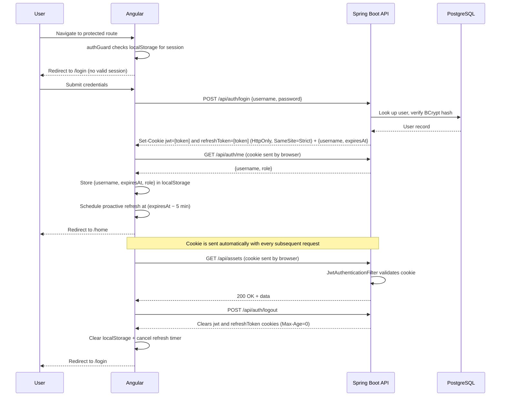

[← Back to README](../README.md)

# Authentication

The application uses **JWT stored in an HttpOnly cookie** (`SameSite=Strict`, `Path=/`), alongside a longer-lived `refreshToken` HttpOnly cookie used only to obtain a new JWT. All `/api/**` endpoints require the `jwt` cookie except the three under `/api/auth/` below. Because the browser attaches cookies automatically to every same-origin request — including `` image loads and the native `EventSource` API — no custom `Authorization` header is needed and there is no risk of token theft via JavaScript.

## Public endpoints

| Method | Path | Description |
|---|---|---|
| `POST` | `/api/auth/login` | Authenticate; sets `jwt` + `refreshToken` HttpOnly cookies and returns `{ "username": "...", "expiresAt": "..." }` |
| `POST` | `/api/auth/refresh` | Reads the `refreshToken` cookie, rotates both cookies, and returns the same response shape as login |
| `POST` | `/api/auth/logout` | Clears both cookies server-side |

`GET /api/auth/me` also exists but is **not** public — it requires the `jwt` cookie and returns the current user's `{ "username": "...", "role": "..." }`.

## JWT flow



## Security configuration classes

| Class | Role |
|---|---|
| `config/SecurityConfig.java` | `SecurityFilterChain` bean; `@Profile("!test")` |
| `config/UserConfig.java` | `UserDetailsService` + `BCryptPasswordEncoder` beans; kept separate from `SecurityConfig` to avoid a circular dependency |
| `infrastructure/service/JwtAuthenticationFilter.java` | Reads the `jwt` cookie on every request |
| `infrastructure/service/JwtTokenServiceAdapter.java` | HMAC-SHA256 token generation/validation |
| `infrastructure/web/filter/RequestCorrelationFilter.java` | Registered at `Ordered.HIGHEST_PRECEDENCE`, ahead of the whole Spring Security chain; see [Request correlation & MDC logging](#request-correlation--mdc-logging) |

## SSE + Spring Security async dispatch

`SseEmitter` writes happen on a Tomcat async dispatch thread, not the
original request thread. Spring Security's filter chain re-runs on that
thread, where `SecurityContextHolder` is empty — without a fix, every SSE
write fails with `AuthorizationDeniedException` ("response is already
committed"). The fix is a rule that must come **first** in
`SecurityFilterChain`:

```java
.authorizeHttpRequests(auth -> auth
        .dispatcherTypeMatchers(DispatcherType.ASYNC).permitAll()   // must be first
        .requestMatchers("/api/auth/login", "/api/auth/logout", "/api/auth/refresh").permitAll()
        .requestMatchers("/api/admin/**").hasRole("ADMIN")
        .requestMatchers("/api/**").authenticated()
        .anyRequest().permitAll()
)
```

This affects every SSE endpoint: catalog, sync, convert, and upload
progress streams.

## Request correlation & MDC logging

`RequestCorrelationFilter` runs at `Ordered.HIGHEST_PRECEDENCE` — before
Spring Security's own filter chain (auto-configured order `-100`) — so a
`requestId` (UUID) and `username` are already in SLF4J MDC, and the
`X-Request-ID` response header already set, no matter how far the request
gets (including a `RateLimitFilter` short-circuit or a Security denial).
Because authentication hasn't happened yet at that point, `username` starts
as `"anonymous"`; once `JwtAuthenticationFilter` validates the `jwt` cookie
and establishes the `SecurityContext`, it overwrites the MDC `username`
entry in place with the real principal, so log lines from that point on in
the request are correlated to the authenticated user rather than
`"anonymous"`. MDC is cleared in a `finally` block once the filter chain
returns.

The `requestId` is echoed back as the `X-Request-ID` response header
(exposed to the browser via CORS `exposedHeaders` in `AppConfig`) so the
Angular `authInterceptor` can append `[Request ID: <id>]` to the error
snackbar it shows the user — giving them something to quote when reporting
an issue, which support can then grep for directly in the JSON log file
(`logstash-logback-encoder` includes both MDC fields in every log line).

## Configuration properties

| Property | Default | Description |
|---|---|---|
| `photomanager.jwt-secret` | *(empty — must be set)* | HS256 signing secret (≥ 32 bytes) |
| `photomanager.jwt-expiry-hours` | `24` | JWT access-token validity in hours |
| `photomanager.refresh-token-expiry-days` | `30` | Refresh-token validity in days |

## Generating JWT_SECRET

Generate a cryptographically random 32-byte base64 string using the command for your platform:

**Linux / macOS:**
```bash
openssl rand -base64 32
```

**Windows (PowerShell):**
```powershell
$bytes = New-Object byte[] 32
[System.Security.Cryptography.RandomNumberGenerator]::Create().GetBytes($bytes)
[Convert]::ToBase64String($bytes)
```

## Setup (local development)

1. Copy `src/main/resources/application-local.yml.example` to `src/main/resources/application-local.yml`
2. Generate a secure secret using the command for your platform (see [Generating JWT_SECRET](#generating-jwt_secret)) and paste the output into `photomanager.jwt-secret` in `application-local.yml`

> **Important:** The application **will not start** if `photomanager.jwt-secret` is blank. `application-local.yml` is git-ignored and must never be committed.

## Setup (Docker Compose)

Set `JWT_SECRET` in `JPPhotoManagerWeb/.env` using the command for your platform:

**Linux / macOS:**
```bash
echo "JWT_SECRET=$(openssl rand -base64 32)" >> JPPhotoManagerWeb/.env
```

**Windows (PowerShell):**
```powershell
$bytes = New-Object byte[] 32
[System.Security.Cryptography.RandomNumberGenerator]::Create().GetBytes($bytes)
$secret = [Convert]::ToBase64String($bytes)
Add-Content -Path JPPhotoManagerWeb\.env -Value "JWT_SECRET=$secret"
```

## Configuring multiple catalog root folders

The backend accepts a semicolon-separated list of root directories via the `photomanager.root-catalog-folders` property. Every directory in the list is scanned recursively when the catalog runs.

### Local development (`application-local.yml`)

Add or extend the `root-catalog-folders` key in `src/main/resources/application-local.yml`:

```yaml
photomanager:
  jwt-secret: "…"
  initial-directory: "C:/Users/yourname/Pictures"
  root-catalog-folders: "C:/Users/yourname/Pictures;C:/Users/yourname/OneDrive/ExtraFolder"
```

`initial-directory` controls which folder is shown first when the gallery loads; it can be any one of the roots (or any sub-folder).

### Docker Compose

Each additional directory must be:

1. Declared in `.env`:
   ```
   HOST_IMAGE_DIR=C:/Users/yourname/Pictures
   HOST_IMAGE_DIR_2=C:/Users/yourname/OneDrive/ExtraFolder
   ```

2. Added as a second bind mount in `docker-compose.yml` under the `backend` service:
   ```yaml
   volumes:
     - type: bind
       source: ${HOST_IMAGE_DIR}
       target: /catalog
     - type: bind
       source: ${HOST_IMAGE_DIR_2}
       target: /catalog2
   ```

3. Included in `CATALOG_DIR` (also in `docker-compose.yml`):
   ```yaml
   environment:
     CATALOG_DIR: /catalog;/catalog2
   ```

After editing both files, recreate the backend container and run the catalog:

```bash
docker compose up -d --force-recreate backend
```

Then click **Run Catalog** in the UI. Repeat steps 1–3 for any further directories (`HOST_IMAGE_DIR_3` → `/catalog3`, etc.).

### Cloud storage paths (Google Drive, OneDrive, etc.)

Docker bind mounts only work with real filesystem paths — they cannot reach cloud storage virtual filesystems, regardless of offline-availability settings.

**Google Drive for Desktop (Windows):** maps your Drive to a virtual drive letter (e.g. `G:\`) using the Windows Cloud Files API. Even when a folder is marked *Available offline* the files are cached locally but still served through this virtual layer. Docker Desktop on Windows runs inside a WSL2 Linux VM, which has no access to virtual drive letters — `G:\My Drive\Photos` is invisible from inside the container, so `/catalog3` will appear empty and no assets will be indexed.

**Google Drive via FUSE (Linux/macOS — rclone, google-drive-ocamlfuse, GNOME GVFS):** FUSE mounts live in the host mount namespace and are not propagated into Docker containers by default. The container again sees an empty directory.

In both cases the `CatalogFolderPartitioner` finds the mount point, sees no files, and silently produces no catalog entries — no error is surfaced.

**Workarounds:**

| Approach | Works on | Notes |
|---|---|---|
| Point to the Backup & Sync local folder (`C:\Users\yourname\Google Drive\…`) | Windows | Only the older *Google Backup and Sync* client stores files as plain NTFS files at an addressable path. Google Drive for Desktop does not. |
| `rclone sync gdrive:FolderName /local/mirror` on a schedule | All | Copy files to a real local path first, then set `HOST_IMAGE_DIR_N` to that path. Most reliable option for the current Google Drive for Desktop client. |
| `robocopy G:\My Drive\FolderName C:\local\mirror /MIR` on a schedule | Windows | Windows-native alternative to rclone. |

## Default admin user

On first startup, if no users exist in the database, the application automatically creates a default administrator:

| Username | Password |
|---|---|
| `admin` | `admin` |

**Change this password immediately** after first login using the **User Administration** page (`/admin/users`).

## User Administration

Navigate to **Users** in the navigation bar (or `/admin/users`) to:
- View all users
- Add new users
- Change a user's password
- Delete users

There is no self-registration; all user management is done by an authenticated administrator.

[← Back to README](../README.md)
