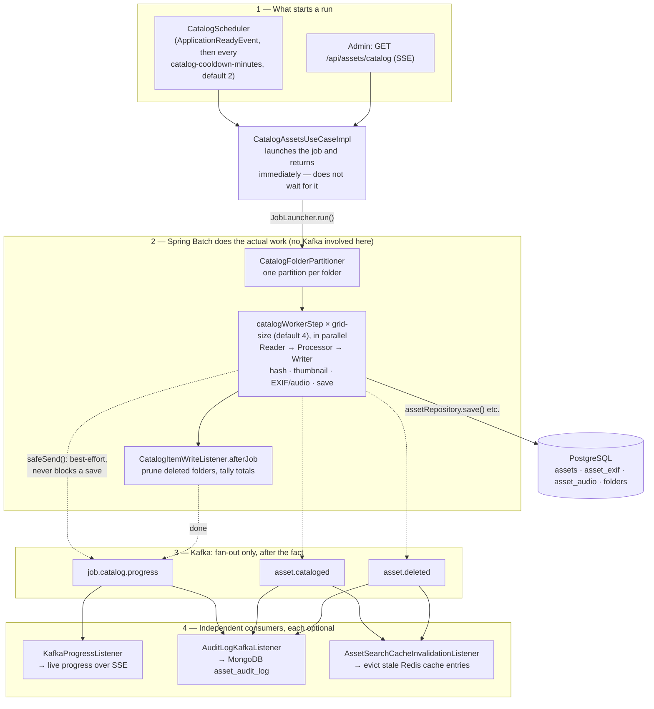

[← Back to README](../README.md)

# Catalog Process

The catalog process scans all configured root folders (`photomanager.root-catalog-folders`), generates thumbnails, computes SHA-256 hashes and EXIF/audio metadata, and persists asset metadata to the database. It is implemented as a **Spring Batch job** (`infrastructure/batch/`), replacing an earlier custom `@Async` loop + hand-rolled distributed-lock design (`catalog_run_state` table, heartbeat, stale-run detection) — that table was dropped by `V16__spring_batch_schema.sql`; if you see it mentioned elsewhere (older docs, comments), it no longer exists. See `openspec/changes/archive/2026-05-24-catalog-spring-batch/` for the migration history.

## Summary — two engines, two jobs

It helps to think of this as **two separate engines that never block each other**:

- **Spring Batch does all the real work.** Something starts a run (a timer, or an admin clicking a button). From that point, Spring Batch owns the whole scan: walking folders, reading files, hashing them, generating thumbnails, reading EXIF/audio tags, and writing `Asset`/`AssetExif`/`AssetAudio` rows to PostgreSQL. This is a normal, synchronous, transactional Spring Batch job — if Kafka didn't exist at all, every asset would still get catalogued exactly the same way.
- **Kafka only fans out *after the fact*.** Every time Spring Batch does something notable (asset written, folder's stale files removed, whole run finished), it drops a message on a Kafka topic and moves on — it never waits for anyone to read that message. Three independent consumers pick those messages up on their own schedule to do things that are *not* part of cataloguing itself: streaming live progress to the browser over SSE, writing an entry to the MongoDB audit log, and evicting stale entries from the Redis search cache. If Kafka is down, assets still get catalogued — you just don't see live progress, and the audit/cache side-effects lag until Kafka comes back (see `safeSend()` below).

So: **"how does a run start?"** → `CatalogScheduler` (automatic, every few minutes) or `GET /api/assets/catalog` (an admin, manually). **"What does Spring Batch do?"** → the actual scanning and database writes, via a partitioned job (one worker thread per folder). **"What does Kafka do?"** → nothing that affects whether an asset gets saved; it's the notification bus for everything downstream of that.



The sections below go into the detail behind each numbered box in the diagram.

## Lifecycle / triggers

The backend owns the catalog lifecycle entirely — the gallery frontend does not trigger catalog runs on page load.

- **Startup + periodic repetition:** `CatalogScheduler` listens for `ApplicationReadyEvent` and immediately submits the first run to a dedicated single-thread `ThreadPoolTaskScheduler` (`AppConfig.catalogTaskScheduler`, pool size 1). After each run's `CompletableFuture` resolves, it waits `photomanager.catalog-cooldown-minutes` (default 2) before the next (`scheduleWithFixedDelay` — delay measured from the **end** of the previous run, so the scheduler never fires a second run on top of itself). This path authenticates as `system-scheduler` (`ROLE_ADMIN`) and passes `userId=null` — there's no real user to attribute a scheduled run to (the `CATALOG_RUN` audit entry it eventually produces, see below, simply has a `null` `userId`).
- **Manual trigger:** `GET /api/assets/catalog` (admin-only, SSE) calls `CatalogAssetsUseCase.execute(runId, userId)` with a fresh `runId = System.currentTimeMillis()` and the caller's resolved user id, then registers an `SseEmitter` keyed by that `runId` in `KafkaProgressRegistry` so the HTTP caller gets a live stream of their own run.
- **Observe-only:** `GET /api/assets/catalog/observe` doesn't start a run; it just registers the caller's `SseEmitter` as a "catalog observer" (`KafkaProgressRegistry.addCatalogObserver`) that receives a broadcast of every catalog/catalog-done event from whichever run is currently in progress (scheduled or manual) — used by the gallery to show live progress without having triggered the run itself.

`ApplicationReadyEvent` isn't published anywhere in this codebase — it's a standard Spring Boot lifecycle event, fired automatically by `SpringApplication.run(PhotoManagerApplication.class, args)` (`PhotoManagerApplication.java:12`, the app's `main()`) once the application context is fully refreshed and all `CommandLineRunner`/`ApplicationRunner` beans have completed. `CatalogScheduler` is one of two `@EventListener(ApplicationReadyEvent.class)` beans that react to it on startup — the other, `DataInitializer` (`config/DataInitializer.java:21`), seeds the default `admin`/`admin` user if none exist.

**Concurrency, honestly:** `CatalogAssetsUseCaseImpl.execute()` catches `JobExecutionAlreadyRunningException` from `JobLauncher.run()` and treats it as "already running, skip" — but since `runId` is unique per launch (a millisecond timestamp) and it's the job's identifying parameter, Spring Batch's `JobRepository` sees every launch as a brand-new `JobInstance`, so that exception in practice never actually fires. The only real protection against overlapping runs is that the scheduler's `ThreadPoolTaskScheduler` has a single thread and each tick blocks (`.get()`) on the previous run's completion future before the next `Runnable` can execute — so the *scheduler* never overlaps with itself, but nothing stops an admin's manual trigger from launching a second job concurrently with a scheduled one.

## Spring Batch job structure

```
catalogJob (JobExecutionListener: CatalogItemWriteListener.afterJob)
└── catalogPartitionStep
    ├── partitions by folder: CatalogFolderPartitioner walks every root in
    │   `photomanager.root-catalog-folders` (semicolon-separated) recursively,
    │   one partition per folder (including the roots themselves)
    ├── parallelism: TaskExecutorPartitionHandler, gridSize =
    │   `photomanager.catalog-partition-grid-size` (default 4) threads
    └── catalogWorkerStep (one execution per partition/folder), chunk size =
        `photomanager.catalog-chunk-size` (default 50)
        ├── reader:    CatalogFileItemReader    — lists files in the folder via StoragePort,
        │              filters out filenames already catalogued for that Folder
        ├── processor: CatalogAssetItemProcessor — per file, synchronously (no Kafka involved):
        │              SHA-256 hash, 200×150 thumbnail, EXIF (images), audio metadata + album
        │              art (audio files), or a placeholder thumbnail (playlists)
        └── writer:    CatalogAssetItemWriter    — saves Asset + AssetExif + AssetAudio (JPA) and
                       the thumbnail (ThumbnailPort); also a StepExecutionListener — after each
                       partition's files are processed (afterStep), compares the Folder's
                       catalogued Assets against what's still on disk and deletes any Asset whose
                       file has disappeared (stale-file cleanup)
```

After the whole job finishes, `CatalogItemWriteListener.afterJob()` calls `PruneDeletedFoldersUseCase.execute(null)` (silently deletes any Folder — and its Assets/thumbnails — whose directory no longer exists on disk at all; no Kafka event is published for this, unlike the per-asset stale-file cleanup above), tallies `foldersScanned`/`assetsAdded` across every `catalogWorkerStep*` execution, and publishes the final `job.catalog.progress` `done` message (see below).

## Kafka messages

The catalog job's Postgres writes never depend on Kafka — hash/thumbnail/EXIF computation and the `Asset`/`AssetExif`/`AssetAudio` saves all happen synchronously in `CatalogAssetItemProcessor`/`CatalogAssetItemWriter` against JPA repositories. Kafka is used purely for **fan-out after the fact**: telling the SSE layer, the audit trail, and the search cache that something changed, without coupling the batch job to any of them directly. Every `kafkaTemplate.send(...)` call in the catalog path goes through a `safeSend()` helper that catches and logs (`WARN`) any publish failure instead of propagating it — a Kafka hiccup (broker restart, topic not yet created) can no longer fail the batch step and roll back an asset that was already persisted. This matters in practice: on Kubernetes, if `k8s/kafka.yaml`'s `log.dirs` isn't pointed at the mounted PVC, every Kafka pod restart wipes all topics, and without `safeSend()` the very next catalog write would time out publishing to a now-missing topic and abort the whole run with zero assets saved.

| Topic | Partitions / retention | Produced by | Consumed by |
|---|---|---|---|
| `job.catalog.progress` | 3 partitions, 1h retention | `CatalogAssetItemWriter.write()` (per-asset `ASSET_CREATED` progress, in `ensureFolderExists()` for `FOLDER_CREATED`, in `afterStep()` for `ASSET_DELETED` stale-cleanup progress) and `CatalogItemWriteListener.afterJob()` (final `done` message: `foldersScanned`, `assetsAdded`, `durationMs`, `userId`) | `KafkaProgressListener.onCatalogProgress` (default per-instance consumer group — forwards non-`done` messages to the triggering run's `SseEmitter` and to every catalog observer; on `done`, completes the emitter, calls `KafkaProgressRegistry.complete(runId)` which resolves the `CompletableFuture` `CatalogAssetsUseCaseImpl.execute()` returned, and broadcasts `catalog-done` to observers) and `AuditLogKafkaListener.onCatalogProgress` (dedicated `audit-log-writer` group — ignores non-`done` messages, writes one `CATALOG_RUN` audit entry per completed run) |
| `asset.cataloged` | 3 partitions, 7d retention | `CatalogAssetItemWriter.write()` — one event per newly-saved asset (`assetId`, `folderPath`, `timestamp`, `userId`) | `AssetSearchCacheInvalidationListener.onAssetCataloged` (dedicated `asset-search-cache-invalidator` group — resolves the folder id from `folderPath` and evicts that folder's `assets:{folderId}:*` Redis cache entries) and `AuditLogKafkaListener.onAssetCataloged` (`audit-log-writer` group — writes one `ASSET_CATALOGED` audit entry per asset) |
| `asset.deleted` | 3 partitions, 7d retention | `CatalogAssetItemWriter.afterStep()` — one event per asset removed because its file vanished from disk since the last scan (`assetId`, `folderId`, `folderPath`, `timestamp`, `permanent=false`, `userId`); **not** produced by the explicit `DELETE /api/assets` admin endpoint or the recycle bin — those don't publish to Kafka at all today | `AssetSearchCacheInvalidationListener.onAssetDeleted` (evicts the folder's cache directly using `event.folderId()`) and `AuditLogKafkaListener.onAssetDeleted` (writes one `ASSET_DELETED` audit entry, metadata `folderId`/`permanent`) |

`asset.uploaded` and `job.upload.progress` (consumed by `AssetHashProcessor`/`AssetExifProcessor`/`AssetThumbnailProcessor` and `KafkaProgressListener.onUploadProgress` respectively) belong to the separate single-file **upload** pipeline (`POST /api/assets/upload`), not the recursive folder catalog scan — mentioned here only to avoid confusing the two when reading `KafkaTopicConfig`.

All topics are declared as `NewTopic` beans in `config/KafkaTopicConfig.java`; Spring's auto-configured `KafkaAdmin` creates them against the broker once at application startup (the broker itself has `auto.create.topics.enable=false`, so nothing else will create them — see `k8s/kafka.yaml`'s `KAFKA_AUTO_CREATE_TOPICS_ENABLE`).

## Frequency configuration

The interval between automatic catalog runs is configured in `JPPhotoManagerWeb/backend/src/main/resources/application.yml`:

```yaml
photomanager:
  catalog-cooldown-minutes: 2
```

It is consumed in `CatalogScheduler.java` (`infrastructure/service/CatalogScheduler.java:25-40`) via `@Value("${photomanager.catalog-cooldown-minutes:2}")`, which schedules `executeCatalogRun()` with a fixed delay of that many minutes, starting on `ApplicationReadyEvent`. It can be overridden with the `photomanager.catalog-cooldown-minutes` property (default 2 minutes if unset).

## Configuration

| Property | Default | Description |
|---|---|---|
| `photomanager.root-catalog-folders` | `${user.home}/Pictures` | Semicolon-separated list of root directories scanned recursively |
| `photomanager.catalog-cooldown-minutes` | `2` | Minutes to wait between catalog runs (fixed delay from end of previous run) |
| `photomanager.catalog-chunk-size` | `50` | Spring Batch chunk size (files read/processed/written per transaction) within each folder's step |
| `photomanager.catalog-partition-grid-size` | `4` | Number of folders processed in parallel per catalog run |

`photomanager.catalog-batch-size` (default `1000`) and `photomanager.catalog-timeout` (default `60`) still exist in `application.yml` but are vestiges of the pre-Spring-Batch heartbeat design described above — `catalog-timeout` isn't read by any code at all, and `catalog-batch-size` is only read by the unrelated `CatalogFolderServiceAdapter` (used by asset cropping, not catalog scanning) into a field that's never actually used. Safe to ignore.

[← Back to README](../README.md)
