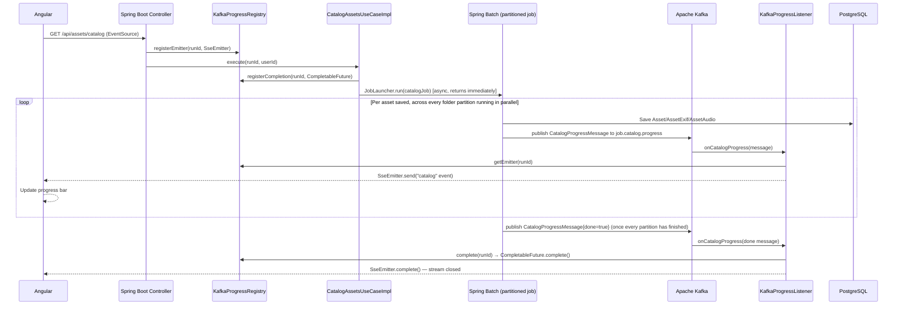

[← Back to README](../README.md)

# Frontend

## Technologies

| Technology | Version |
|---|---|
| Angular | 19 |
| Angular Material | 19 |
| Angular CDK | 19 |
| Angular Service Worker (PWA) | 19 |
| TypeScript | 5.6 |
| RxJS | 7.8 |
| ngx-charts | 24.0.0-alpha.1 |
| idb (IndexedDB wrapper, background sync) | 8.0.3 |
| Node.js (build/dev) | 22 |
| Cypress (component + e2e tests) | 15 |
| ESLint (`@angular-eslint`, `typescript-eslint`) | 9 |

## Application structure

```
src/app/
  app.component.ts/html/scss   → Shell with top navigation bar (shown only when logged in)
  app.routes.ts                → Lazy routes: /home, /gallery, /sync, /convert, /duplicates,
                                 /albums, /albums/:id, /recycle-bin, /admin/users, /analytics
  app.config.ts                → ApplicationConfig (HttpClient + interceptor, Router, Animations)
  core/
    models/                    → TypeScript interfaces (Asset, Folder, PaginatedData, …)
    services/                  → Angular services wrapping the backend REST API
    guards/                    → auth.guard.ts — redirects unauthenticated users to /login
    interceptors/              → auth.interceptor.ts — handles 401 → redirect to /login
  features/
    auth/login/                → LoginComponent (/login)
    home/                      → HomeComponent (/home) — dashboard with stats
    gallery/                   → Thumbnail grid + full-size image viewer
    folder-nav/                → Folder tree (Angular CDK FlatTreeControl)
    sync/                      → Sync configuration and execution
    convert/                   → Convert configuration and execution
    duplicates/                → Duplicate detection and cleanup
    albums/                    → AlbumsComponent + AlbumDetailComponent
    recycle-bin/                → Restore/purge soft-deleted assets
    analytics/                  → Storage/format/rating charts (ngx-charts)
    audio-player/                → Playback controls for streamed audio assets
    admin/users/                → UserAdminComponent (/admin/users) — add/change password/delete users
  shared/
    components/thumbnail/      → Reusable thumbnail card component
    pipes/file-size.pipe.ts    → Human-readable file size formatting
```

All components are **standalone** (no NgModules). Routes are lazy-loaded and, except `/login`, protected by `authGuard`:

| Path | Feature | Description |
|---|---|---|
| `/` | — | Redirects to `/home` |
| `/login` | Login | Public login form |
| `/home` | Home | Dashboard with catalog statistics |
| `/gallery` | Gallery | Paginated thumbnail grid and full-size viewer |
| `/sync` | Sync | Configure and run directory sync |
| `/convert` | Convert | Configure and run PNG→JPEG conversion |
| `/duplicates` | Duplicates | Find and remove duplicate images |
| `/albums` | Albums | List, create, rename, and delete albums |
| `/albums/:id` | Album detail | Paginated asset grid within an album |
| `/recycle-bin` | Recycle Bin | Restore or purge soft-deleted assets |
| `/admin/users` | User Administration | Add, change password, delete users |
| `/analytics` | Analytics | Storage, format, monthly, and rating charts |

## Gallery modes

- **Thumbnails mode** — paginated grid; each card displays a 200×150 thumbnail fetched from `/api/assets/{id}/thumbnail`.
- **Viewer mode** — full-screen; loads the original file from `/api/assets/{id}/image` with zoom controls. Double-click a thumbnail to enter viewer mode; click the grid icon to return.

## Real-time progress

Long-running operations (catalog, sync, convert) use the browser's native `EventSource` API to consume SSE streams from the backend, displaying live progress without polling.

**SSE (Server-Sent Events)** is a web standard where the server pushes a stream of text events to the client over a single long-lived HTTP connection. It is one-way (server → client only), HTTP-based — the client makes a regular `GET` request and the response stays open while the server writes `data: ...` lines as events occur — and browsers handle reconnection automatically if the connection drops.

**Kafka-mediated SSE pipeline:** progress events are not sent directly from the use case to the HTTP response. Instead, the catalog/sync/convert code publishes messages to a Kafka topic, and `KafkaProgressListener` looks up the registered `SseEmitter` for the run and forwards each message to the client. Unlike the audit-log/cache-invalidation consumers (which use a fixed, shared consumer group so exactly one backend instance processes each event), `KafkaProgressListener` relies on the default consumer group `spring.kafka.consumer.group-id: sse-broadcaster-${HOSTNAME}` — unique **per backend instance** — so that whichever replica is actually holding the client's SSE connection always gets its own copy of every progress message, regardless of which instance's `JobLauncher` is running the batch job. This decouples the long-running work from the HTTP layer and from any particular instance, and makes the pipeline observable by any downstream consumer.

For the catalog case specifically, the actual scanning/persisting happens inside a Spring Batch job with no `catalog_run_state`-style lock or heartbeat (see [Catalog Process](catalog-process.md#catalog-process) for the full picture — that custom table was dropped years ago in favor of Spring Batch's own job repository):



## Running the frontend

**Prerequisites:** Node.js 22, npm

```bash
cd JPPhotoManagerWeb/frontend

# Install dependencies
npm install

# Run development server (proxies /api to localhost:8080)
npm start
```

The app is available at `http://localhost:4200`. The dev server automatically proxies `/api` requests to the backend.

### Development proxy

All frontend services use **relative paths** (`/api/assets`, `/api/folders`, …) rather than hardcoded ports. During development, Angular's dev server forwards every `/api` request to the Spring Boot backend via `proxy.conf.json`:

```json
{
  "/api": {
    "target": "http://localhost:8080",
    "secure": false,
    "changeOrigin": true
  }
}
```

The browser only ever contacts port **4200** (the `ng serve` dev server's default port); the proxy rewrites and forwards the request to port **8080** on the server side. Port 4200 is a local-development-only detail — the Docker Compose setup exposes the app on port **80** via nginx instead. This means:

- No CORS headers are needed in development — both the HTML page and the API responses come from the same origin (`localhost:4200`).
- Image `` tags, `EventSource` SSE connections, and `HttpClient` calls all work automatically because the browser always uses the same origin.
- Changing the backend port only requires updating `proxy.conf.json` — no source code change.

In production the Angular build produces a static bundle that is served by **nginx** (`nginx.conf`), which applies the identical routing rule:

```nginx
location /api/ {
    proxy_pass http://backend:8080/api/;
}
```

## Building for production

```bash
cd JPPhotoManagerWeb/frontend
npm run build:prod
```

Output goes to `dist/jp-photo-manager-ui/`.

## Running frontend tests

Tests are **Cypress Component Testing** (`*.cy.ts` files colocated with the code under test) plus a separate Cypress E2E suite — there is no Karma/Jasmine setup.

```bash
cd JPPhotoManagerWeb/frontend

# Component tests, headless (what CI runs)
npm test

# Component tests with code coverage
npm run test:coverage

# End-to-end tests, headless (requires the app running — see e2e-testing skill)
npm run test:e2e

# Interactive Cypress runner (component mode)
npm run cypress:open

# Interactive Cypress runner (e2e mode)
npm run cypress:e2e

# Lint
npm run lint
```

---

---

## Installing as a Progressive Web App (PWA)

JP Photo Manager ships as a PWA: it can be installed as a standalone desktop or mobile app directly from the browser, with offline thumbnail caching and background sync for rating changes.

> **Important:** The PWA service worker only activates in a **production build**. Install prompts will not appear when running the Angular dev server (`npm start`). Use the Docker Compose setup or a production build served by nginx.

### Prerequisites

The app must be running via Docker Compose (see [Running with Docker Compose](docker-compose.md#running-with-docker-compose)):

```bash
cd JPPhotoManagerWeb
cp .env.example .env
# Edit .env: set HOST_IMAGE_DIR and JWT_SECRET at minimum
docker compose up --build
```

Then open `http://localhost` in a supported browser.

### Installing from the browser

| Browser | How to install |
|---|---|
| **Chrome / Edge** | An install icon (⊕) appears in the address bar — click it, then **Install** |
| **Chrome (menu)** | ⋮ menu → **Save and share** → **Install JP Photo Manager** |
| **Edge (menu)** | ··· menu → **Apps** → **Install this site as an app** |
| **Safari (macOS)** | **File** → **Add to Dock** (requires macOS Sonoma or later) |
| **Safari (iOS)** | Share sheet → **Add to Home Screen** |
| **Firefox** | Not supported — Firefox does not implement PWA installation |

Once installed the app opens in its own window (no browser chrome) under the name **JP Photo Manager** (short name: **PhotoMgr**).

### PWA capabilities

| Capability | Detail |
|---|---|
| **Offline thumbnail cache** | Previously viewed thumbnails are served from the service-worker cache when the network is unavailable (cache-first strategy configured in `ngsw-config.json`) |
| **Background sync for ratings** | Star-rating changes made while offline are queued in IndexedDB via `BackgroundSyncService` and replayed automatically when connectivity is restored; a snackbar notification confirms the replay |
| **App icons** | Full icon set from 72×72 to 512×512 pixels, suitable for home screens and taskbars |


[← Back to README](../README.md)
