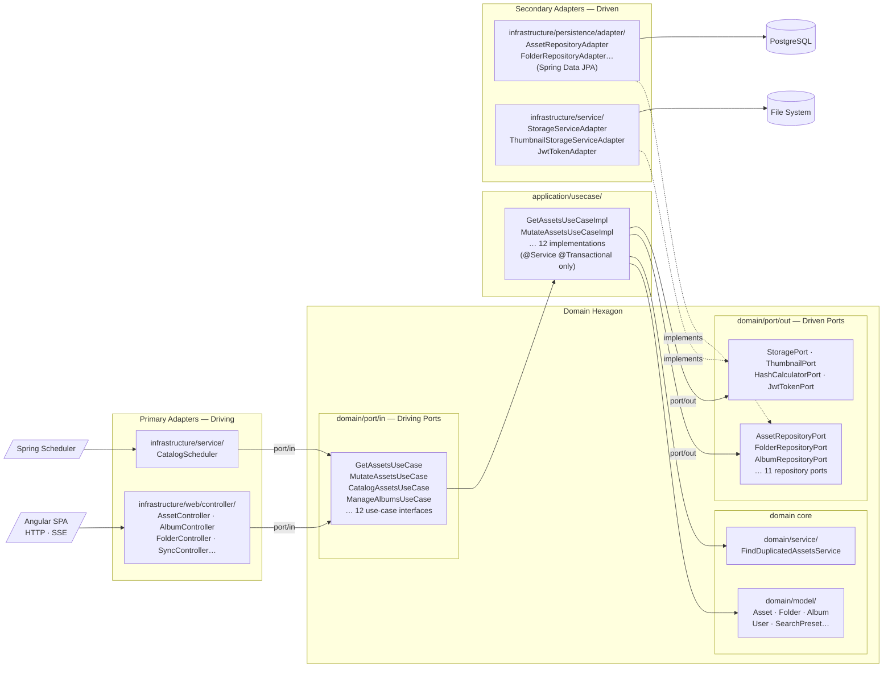

# Spec: Hexagonal Architecture (Ports & Adapters)

## Overview

Refactor the backend package structure so the domain layer is completely free of framework dependencies, business logic is expressed through focused use-case interfaces, and all framework-specific code (JPA, Spring MVC, Spring Security, file I/O) is encapsulated in adapter classes inside the `infrastructure/` package tree.

No functional behaviour, REST API surface, or database schema changes.

---

## Structural Invariants (must hold after migration)

### Domain purity

**INV-1:** No class under `domain/` may import from `jakarta.*`, `org.springframework.*`, `com.fasterxml.jackson.*`, or `com.jpablodrexler.photomanager.infrastructure.*`.

**INV-2:** No class under `domain/model/` may carry any ORM annotation (`@Entity`, `@Table`, `@Column`, `@Id`, `@ManyToOne`, etc.).

**INV-3:** No interface under `domain/port/out/` may extend `JpaRepository`, `JpaSpecificationExecutor`, or any other Spring Data interface.

**INV-4:** Port interfaces under `domain/port/out/` must use only `java.*`, `domain/model/`, `domain/enums/`, and `application/dto/` types in their method signatures.

### Application layer purity

**INV-5:** Use-case implementation classes under `application/usecase/` may only carry `@Service` and `@Transactional` Spring annotations. No other `org.springframework.*` annotations are permitted.

**INV-6:** No class under `application/` may import from `infrastructure.*` or `org.springframework.web.*` or `org.springframework.data.*`.

**INV-7:** No class under `application/` may import from `infrastructure/web/` (i.e. the application layer must not reference HTTP DTOs).

### Infrastructure isolation

**INV-8:** All `@RestController`, `@RequestMapping`, and Spring MVC annotations exist only in `infrastructure/web/controller/`.

**INV-9:** All `@Entity` and JPA persistence annotations exist only in `infrastructure/persistence/entity/`.

**INV-10:** All Spring Data JPA repository interfaces (`extends JpaRepository`) exist only in `infrastructure/persistence/jpa/`.

---

## Use-Case Interface Contract

Each driving port interface in `domain/port/in/` represents a single cohesive domain operation. The contract for each interface:

### GetAssetsUseCase

```java
PaginatedResult<Asset> getAssets(AssetFilter filter);
AssetImage getAssetImage(Long assetId) throws IOException;
AssetExif getAssetExif(Long assetId);
void downloadAssets(List<Long> assetIds, OutputStream out) throws IOException;
```

### MutateAssetsUseCase

```java
void rateAsset(Long assetId, int rating);
void moveAssets(List<Long> assetIds, String destinationPath, boolean preserveOriginal) throws IOException;
void uploadAsset(String folderPath, String fileName, byte[] content) throws IOException;
void deleteAssets(List<Long> assetIds, boolean permanently) throws IOException;
```

### CatalogAssetsUseCase

```java
CompletableFuture<Void> catalogAssetsAsync(Consumer<CatalogChangeNotification> listener);
```

### GetDuplicatedAssetsUseCase

```java
List<List<Asset>> getDuplicatedAssets();
```

### ManageAlbumsUseCase

```java
PaginatedResult<AlbumData> getAlbums(UUID userId, int page);
AlbumData createAlbum(UUID userId, String name, String description);
AlbumData getAlbum(Long albumId, UUID userId, int page);
AlbumData updateAlbum(Long albumId, UUID userId, String name, String description);
void deleteAlbum(Long albumId, UUID userId);
void addAssetsToAlbum(Long albumId, UUID userId, List<Long> assetIds);
void removeAssetsFromAlbum(Long albumId, UUID userId, List<Long> assetIds);
```

### SyncAssetsUseCase

```java
List<SyncDirectoriesDefinition> getSyncConfiguration();
void saveSyncConfiguration(List<SyncDirectoriesDefinition> definitions);
CompletableFuture<Void> syncAssetsAsync(Consumer<SyncAssetsResult> listener);
```

### ConvertAssetsUseCase

```java
List<ConvertDirectoriesDefinition> getConvertConfiguration();
void saveConvertConfiguration(List<ConvertDirectoriesDefinition> definitions);
CompletableFuture<Void> convertAssetsAsync(Consumer<ConvertAssetsResult> listener);
```

### GetFoldersUseCase

```java
List<Folder> getSubFolders(String parentPath);
List<String> getDrives();
String getInitialFolder();
List<String> getRecentTargetPaths();
```

### RecycleBinUseCase

```java
PaginatedResult<Asset> getDeletedAssets(int page);
void restoreAssets(List<Long> assetIds);
void purgeAssets(List<Long> assetIds) throws IOException;
```

### ManageSearchPresetsUseCase

```java
List<SearchPreset> getPresets(UUID userId);
SearchPreset createPreset(UUID userId, String name, FilterPreset criteria);
void deletePreset(Long presetId, UUID userId);
```

### GetHomeStatsUseCase

```java
HomeStats getHomeStats();
```

### UserAdminUseCase

```java
List<UserSummary> listUsers();
UserSummary createUser(String username, String password, String role);
void updatePassword(UUID userId, String newPassword);
void deleteUser(UUID userId);
```

---

## Driven Port Interface Contract

Each secondary port in `domain/port/out/` must be a plain Java interface. Representative contracts:

### AssetRepositoryPort

```java
Optional<Asset> findById(Long id);
Optional<Asset> findByFolderAndFileName(Folder folder, String fileName);
PaginatedResult<Asset> findFiltered(AssetFilter filter);
List<Asset> findByFolder(Folder folder);
List<Asset> findAll();
Asset save(Asset asset);
void deleteById(Long id);
long countTotal();
long countDeleted();
```

### FolderRepositoryPort

```java
Optional<Folder> findById(Long id);
Optional<Folder> findByPath(String path);
boolean existsByPath(String path);
List<Folder> findSubFolders(String parentPath);
Folder save(Folder folder);
void deleteById(Long id);
long count();
```

### StoragePort

```java
List<String> listFiles(String directoryPath);
List<String> listSubDirectories(String directoryPath);
boolean directoryExists(String path);
void createDirectory(String path);
byte[] readFileBytes(String filePath) throws IOException;
void copyFile(String sourcePath, String destinationPath) throws IOException;
void moveFile(String sourcePath, String destinationPath) throws IOException;
void deleteFile(String filePath) throws IOException;
byte[] generateThumbnail(String filePath, int maxWidth, int maxHeight) throws IOException;
String computeSha256(String filePath) throws IOException;
ImageRotation readExifRotation(String filePath) throws IOException;
```

---

## Target Mermaid Architecture Diagram



---

## Verification Checklist

- [ ] `grep -r "import jakarta" src/main/java/com/jpablodrexler/photomanager/domain/` returns empty
- [ ] `grep -r "import org.springframework" src/main/java/com/jpablodrexler/photomanager/domain/` returns empty
- [ ] `grep -r "import org.springframework.web\|import org.springframework.data" src/main/java/com/jpablodrexler/photomanager/application/` returns empty
- [ ] `grep -r "import com.jpablodrexler.photomanager.infrastructure" src/main/java/com/jpablodrexler/photomanager/application/` returns empty
- [ ] `mvn clean package` exits 0
- [ ] `mvn test` exits 0
- [ ] App starts and gallery loads with real data
