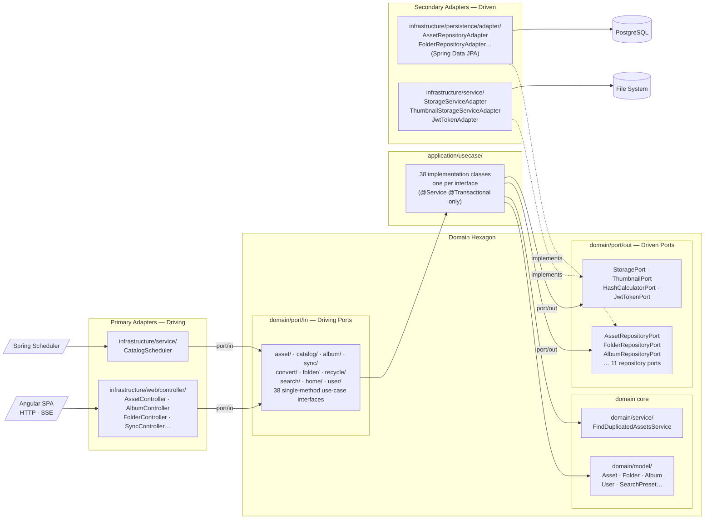

# Spec: Hexagonal Architecture (Ports & Adapters)

## Overview

Refactor the backend package structure so the domain layer is completely free of framework dependencies, business logic is expressed through focused use-case interfaces, and all framework-specific code (JPA, Spring MVC, Spring Security, file I/O) is encapsulated in adapter classes inside the `infrastructure/` package tree.

No functional behaviour, REST API surface, or database schema changes.

---

## Structural Invariants (must hold after migration)

### Domain purity

**INV-1:** No class under `domain/` may import from `jakarta.*`, `org.springframework.*`, `com.fasterxml.jackson.*`, or `com.jpablodrexler.photomanager.infrastructure.*`.

**INV-2:** No class under `domain/model/` may carry any ORM annotation (`@Entity`, `@Table`, `@Column`, `@Id`, `@ManyToOne`, etc.).

**INV-3:** No interface under `domain/port/out/` may extend `JpaRepository`, `JpaSpecificationExecutor`, or any other Spring Data interface.

**INV-4:** Port interfaces under `domain/port/out/` must use only `java.*`, `domain/model/`, `domain/enums/`, and `application/dto/` types in their method signatures.

### Application layer purity

**INV-5:** Use-case implementation classes under `application/usecase/` may only carry `@Service` and `@Transactional` Spring annotations. No other `org.springframework.*` annotations are permitted.

**INV-6:** No class under `application/` may import from `infrastructure.*` or `org.springframework.web.*` or `org.springframework.data.*`.

**INV-7:** No class under `application/` may import from `infrastructure/web/` (i.e. the application layer must not reference HTTP DTOs).

### Infrastructure isolation

**INV-8:** All `@RestController`, `@RequestMapping`, and Spring MVC annotations exist only in `infrastructure/web/controller/`.

**INV-9:** All `@Entity` and JPA persistence annotations exist only in `infrastructure/persistence/entity/`.

**INV-10:** All Spring Data JPA repository interfaces (`extends JpaRepository`) exist only in `infrastructure/persistence/jpa/`.

---

## Use-Case Interface Contract

Each driving port interface in `domain/port/in/` represents a single cohesive domain operation. The contract for each interface:

Each interface has exactly one method named `execute`. Each implementation class implements exactly one interface.

### asset/ (8 interfaces)

```java
// GetAssetsUseCase          → GetAssetsUseCaseImpl
PaginatedResult<Asset> execute(AssetFilter filter);

// GetAssetImageUseCase      → GetAssetImageUseCaseImpl
AssetImage execute(Long assetId) throws IOException;

// GetAssetExifUseCase       → GetAssetExifUseCaseImpl
AssetExif execute(Long assetId);

// DownloadAssetsUseCase     → DownloadAssetsUseCaseImpl
void execute(List<Long> assetIds, OutputStream out) throws IOException;

// RateAssetUseCase          → RateAssetUseCaseImpl
void execute(Long assetId, int rating);

// MoveAssetsUseCase         → MoveAssetsUseCaseImpl
void execute(List<Long> assetIds, String destinationPath, boolean preserveOriginal) throws IOException;

// UploadAssetUseCase        → UploadAssetUseCaseImpl
void execute(String folderPath, String fileName, byte[] content) throws IOException;

// DeleteAssetsUseCase       → DeleteAssetsUseCaseImpl
void execute(List<Long> assetIds, boolean permanently) throws IOException;
```

### catalog/ (2 interfaces)

```java
// CatalogAssetsUseCase      → CatalogAssetsUseCaseImpl
CompletableFuture<Void> execute(Consumer<CatalogChangeNotification> listener);

// GetDuplicatedAssetsUseCase → GetDuplicatedAssetsUseCaseImpl
List<List<Asset>> execute();
```

### album/ (7 interfaces)

```java
// GetAlbumsUseCase          → GetAlbumsUseCaseImpl
PaginatedResult<AlbumData> execute(UUID userId, int page);

// CreateAlbumUseCase        → CreateAlbumUseCaseImpl
AlbumData execute(UUID userId, String name, String description);

// GetAlbumUseCase           → GetAlbumUseCaseImpl
AlbumData execute(Long albumId, UUID userId, int page);

// UpdateAlbumUseCase        → UpdateAlbumUseCaseImpl
AlbumData execute(Long albumId, UUID userId, String name, String description);

// DeleteAlbumUseCase        → DeleteAlbumUseCaseImpl
void execute(Long albumId, UUID userId);

// AddAssetsToAlbumUseCase   → AddAssetsToAlbumUseCaseImpl
void execute(Long albumId, UUID userId, List<Long> assetIds);

// RemoveAssetsFromAlbumUseCase → RemoveAssetsFromAlbumUseCaseImpl
void execute(Long albumId, UUID userId, List<Long> assetIds);
```

### sync/ (3 interfaces)

```java
// GetSyncConfigUseCase      → GetSyncConfigUseCaseImpl
List<SyncDirectoriesDefinition> execute();

// SaveSyncConfigUseCase     → SaveSyncConfigUseCaseImpl
void execute(List<SyncDirectoriesDefinition> definitions);

// SyncAssetsUseCase         → SyncAssetsUseCaseImpl
CompletableFuture<Void> execute(Consumer<SyncAssetsResult> listener);
```

### convert/ (3 interfaces)

```java
// GetConvertConfigUseCase   → GetConvertConfigUseCaseImpl
List<ConvertDirectoriesDefinition> execute();

// SaveConvertConfigUseCase  → SaveConvertConfigUseCaseImpl
void execute(List<ConvertDirectoriesDefinition> definitions);

// ConvertAssetsUseCase      → ConvertAssetsUseCaseImpl
CompletableFuture<Void> execute(Consumer<ConvertAssetsResult> listener);
```

### folder/ (4 interfaces)

```java
// GetSubFoldersUseCase      → GetSubFoldersUseCaseImpl
List<Folder> execute(String parentPath);

// GetDrivesUseCase          → GetDrivesUseCaseImpl
List<String> execute();

// GetInitialFolderUseCase   → GetInitialFolderUseCaseImpl
String execute();

// GetRecentTargetPathsUseCase → GetRecentTargetPathsUseCaseImpl
List<String> execute();
```

### recycle/ (3 interfaces)

```java
// GetDeletedAssetsUseCase   → GetDeletedAssetsUseCaseImpl
PaginatedResult<Asset> execute(int page);

// RestoreAssetsUseCase      → RestoreAssetsUseCaseImpl
void execute(List<Long> assetIds);

// PurgeAssetsUseCase        → PurgeAssetsUseCaseImpl
void execute(List<Long> assetIds) throws IOException;
```

### search/ (3 interfaces)

```java
// GetSearchPresetsUseCase   → GetSearchPresetsUseCaseImpl
List<SearchPreset> execute(UUID userId);

// CreateSearchPresetUseCase → CreateSearchPresetUseCaseImpl
SearchPreset execute(UUID userId, String name, FilterPreset criteria);

// DeleteSearchPresetUseCase → DeleteSearchPresetUseCaseImpl
void execute(Long presetId, UUID userId);
```

### home/ (1 interface)

```java
// GetHomeStatsUseCase       → GetHomeStatsUseCaseImpl
HomeStats execute();
```

### user/ (4 interfaces)

```java
// ListUsersUseCase          → ListUsersUseCaseImpl
List<UserSummary> execute();

// CreateUserUseCase         → CreateUserUseCaseImpl
UserSummary execute(String username, String password, String role);

// UpdatePasswordUseCase     → UpdatePasswordUseCaseImpl
void execute(UUID userId, String newPassword);

// DeleteUserUseCase         → DeleteUserUseCaseImpl
void execute(UUID userId);
```

---

## Driven Port Interface Contract

Each secondary port in `domain/port/out/` must be a plain Java interface. Representative contracts:

### AssetRepositoryPort

```java
Optional<Asset> findById(Long id);
Optional<Asset> findByFolderAndFileName(Folder folder, String fileName);
PaginatedResult<Asset> findFiltered(AssetFilter filter);
List<Asset> findByFolder(Folder folder);
List<Asset> findAll();
Asset save(Asset asset);
void deleteById(Long id);
long countTotal();
long countDeleted();
```

### FolderRepositoryPort

```java
Optional<Folder> findById(Long id);
Optional<Folder> findByPath(String path);
boolean existsByPath(String path);
List<Folder> findSubFolders(String parentPath);
Folder save(Folder folder);
void deleteById(Long id);
long count();
```

### StoragePort

```java
List<String> listFiles(String directoryPath);
List<String> listSubDirectories(String directoryPath);
boolean directoryExists(String path);
void createDirectory(String path);
byte[] readFileBytes(String filePath) throws IOException;
void copyFile(String sourcePath, String destinationPath) throws IOException;
void moveFile(String sourcePath, String destinationPath) throws IOException;
void deleteFile(String filePath) throws IOException;
byte[] generateThumbnail(String filePath, int maxWidth, int maxHeight) throws IOException;
String computeSha256(String filePath) throws IOException;
ImageRotation readExifRotation(String filePath) throws IOException;
```

---

## Target Mermaid Architecture Diagram



---

## Verification Checklist

- [ ] `grep -r "import jakarta" src/main/java/com/jpablodrexler/photomanager/domain/` returns empty
- [ ] `grep -r "import org.springframework" src/main/java/com/jpablodrexler/photomanager/domain/` returns empty
- [ ] `grep -r "import org.springframework.web\|import org.springframework.data" src/main/java/com/jpablodrexler/photomanager/application/` returns empty
- [ ] `grep -r "import com.jpablodrexler.photomanager.infrastructure" src/main/java/com/jpablodrexler/photomanager/application/` returns empty
- [ ] `mvn clean package` exits 0
- [ ] `mvn test` exits 0
- [ ] App starts and gallery loads with real data

---

## Documentation Requirements

After the refactor is complete, `CLAUDE.md` and `README.md` must reflect the new architecture so that the project's reference documentation is accurate.

### CLAUDE.md — Backend architecture section

The _Web Architecture → Backend_ section must be updated to match the hexagonal layout:

**Package tree** (replace the existing diagram):

```
domain/
  model/               → Plain POJO domain models (no JPA annotations)
  port/
    in/                → Driving port interfaces (use-case contracts)
      asset/ catalog/ album/ sync/ convert/ folder/ recycle/ search/ home/ user/
    out/               → Driven port interfaces (repository + service contracts)
  service/             → Stateless domain services (e.g. FindDuplicatedAssetsService)
  enums/               → ImageRotation, SortCriteria, …
application/
  usecase/             → Use-case implementations (@Service @Transactional only)
    asset/ catalog/ album/ sync/ convert/ folder/ recycle/ search/ home/ user/
  dto/                 → PaginatedResult<T>, AssetFilter, and other application-layer DTOs
infrastructure/
  persistence/
    entity/            → JPA entities (*Entity classes, all @Entity annotations live here)
    jpa/               → Spring Data JPA interfaces (extends JpaRepository)
    adapter/           → Repository adapters implementing domain/port/out/ interfaces
    mapper/            → Entity ↔ domain model mappers
  web/
    controller/        → @RestController classes (one per domain area)
    dto/               → HTTP request/response DTOs
    mapper/            → Domain model ↔ HTTP DTO converters
    exception/         → GlobalExceptionHandler and error types
  service/             → Service adapters (StorageServiceAdapter, ThumbnailStorageServiceAdapter, JwtTokenAdapter)
config/                → AppConfig (CORS, async executor)
```

**Dependency flow** (replace existing line):

```
infrastructure/web → application/usecase → domain ← infrastructure/persistence
                                                    ← infrastructure/service
```

**Key domain services** — update the prose to describe use-case interfaces instead of old service classes; remove all references to `PhotoManagerFacade` and `PhotoManagerFacadeImpl`.

### README.md — Backend architecture

The README must include:

1. The Mermaid architecture diagram from this spec (Primary Adapters → Domain Hexagon → Secondary Adapters).
2. A short explanation of the `domain/port/in/` convention: each interface has exactly one `execute` method and represents a single use case; implementations live in `application/usecase/`.
3. A short explanation of the `domain/port/out/` convention: plain Java interfaces that infrastructure adapters implement; no Spring or JPA types in method signatures.
4. A note that `infrastructure/web/controller/` classes inject use-case interfaces directly — they never call repositories or service adapters.
